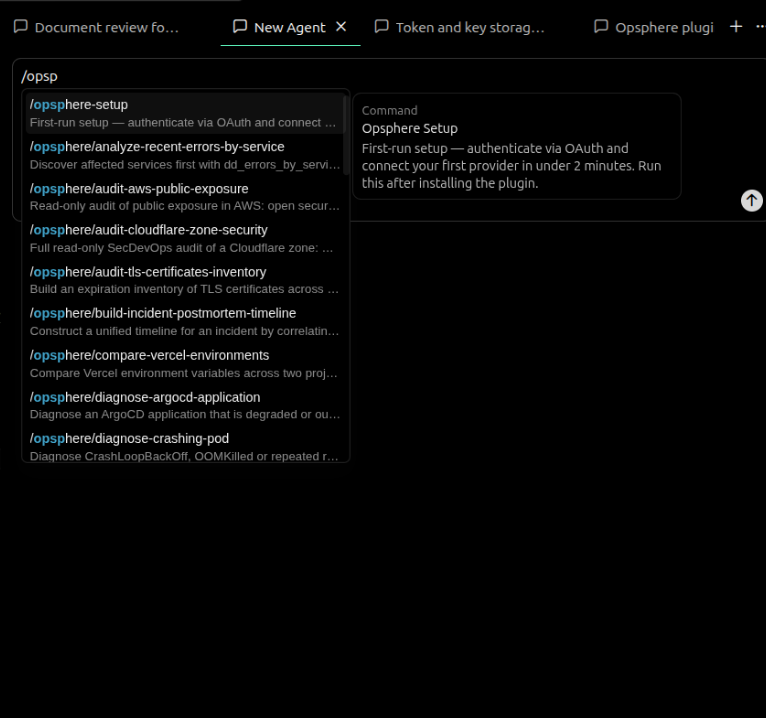
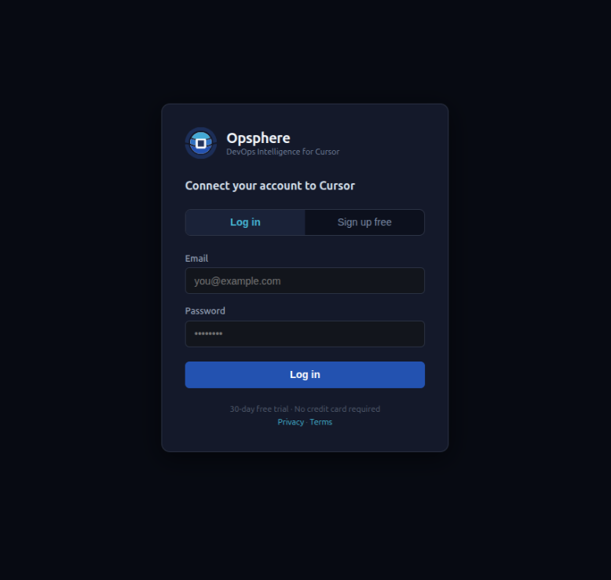
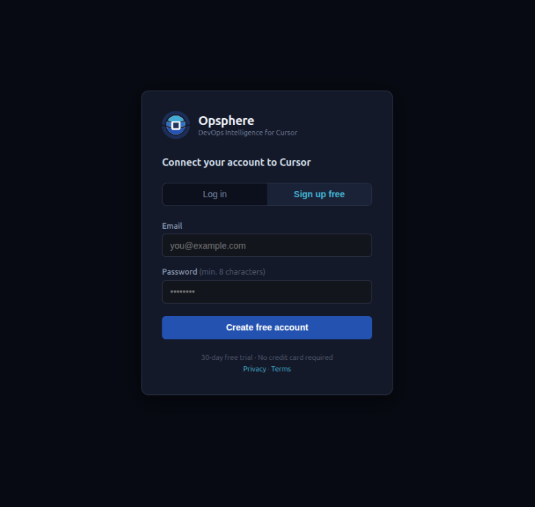
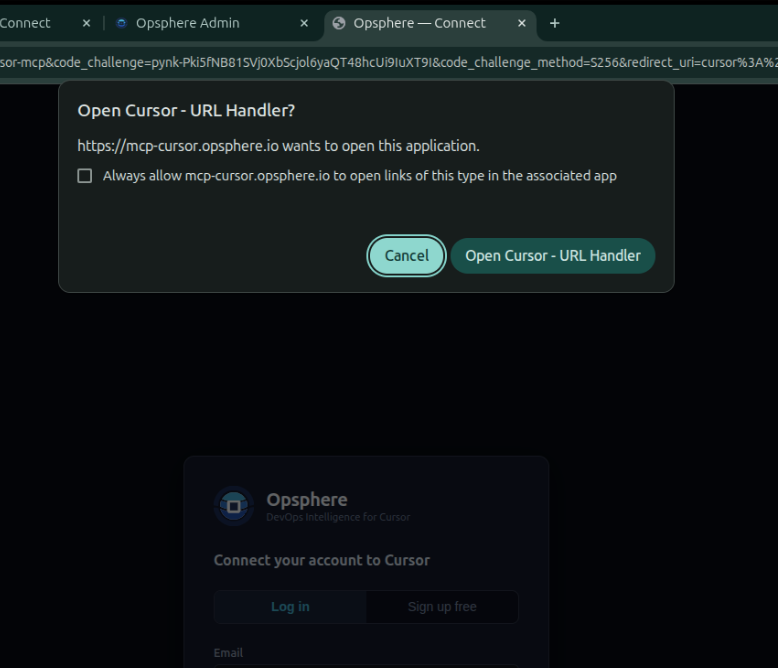
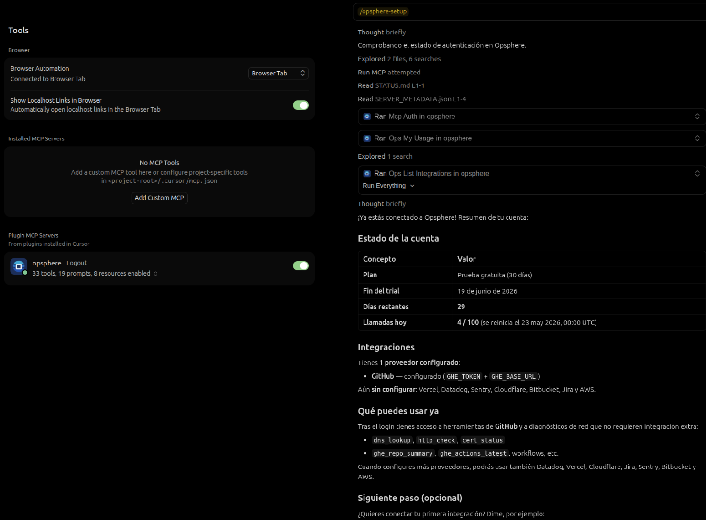

# Opsphere — DevOps & SRE Intelligence for Cursor

> Query logs, diagnose incidents, check deploys, and manage your infrastructure — without leaving the IDE.

[](https://github.com/opsphere-io/opsphere-plugin/releases)
[](https://github.com/opsphere-io/opsphere-plugin/releases)
[](LICENSE)
[](https://github.com/opsphere-io/opsphere-plugin/actions/workflows/ci.yml)
[](https://cursor.com)


---

## What is Opsphere?

Opsphere is a **DevOps and SRE intelligence plugin** for Cursor. It connects your monitoring, deployment, and issue-tracking stack to the AI agent through a **secure remote MCP gateway** (`mcp-cursor.opsphere.io`). The plugin bundle ships rules, skills, agents, and `mcp.json`; tool execution and credential storage run on the gateway. Ask in natural language:

- _"Search Datadog logs for payment errors in the last hour"_
- _"What's failing in Sentry right now?"_
- _"What was the last deployment in production?"_ — `deployment_status` across your configured platforms
- _"Check DNS for mysite.com across all resolvers"_
- _"Diagnose the failed Bitbucket pipeline"_

Everything runs through a **secure remote MCP server** — by design. Credentials are not stored in the plugin bundle or your workspace. OAuth2 + PKCE via Cursor Connect.

Architecture diagram and domain list: **[docs/REMOTE-MCP-ARCHITECTURE.md](docs/REMOTE-MCP-ARCHITECTURE.md)**.

---

## Quick Start

1. **Install** Opsphere from the Cursor Marketplace.
2. **Welcome**: type **`/opsphere-welcome`** in chat (or **`/opsphere-setup`** for full onboarding) — see example prompts and next steps.
3. **Connect**: click **Connect** next to Opsphere in **Cursor Settings → MCP**. A browser window opens — sign up (free, no card needed) or log in. Cursor stores the token automatically.
4. **Connect your tools**: say _"Configure my Datadog"_ — the agent walks you through setup and sends credentials **only** via `ops_configure_integration` on the gateway (never stored in this repo or in Cursor's plugin files).
5. **Start asking**: say _"Check DNS for mysite.com"_ or _"What was the last deployment?"_ — you're live.

> **Network tools** (`dns_lookup`, `http_check`, `cert_status`) work immediately after step 3 — no integration setup needed.

### Slash commands (type in chat)

| Command | When to use |
|---------|-------------|
| **`/opsphere-welcome`** | Just installed — quick tips and example prompts |
| **`/opsphere-setup`** | First-run OAuth + first integration (step by step) |
| **`/opsphere-reconnect`** | Plugin red / OAuth refresh error — recover session |
| **`/integration-status`** | See which providers are connected |

Type **`/opsphere-welcome`** after install for example prompts including subagents (`/outage-triage`, `/endpoint-health`, `/ci-investigator`, `/postmortem-writer`).

No shell scripts run automatically when you open a workspace — you invoke commands and subagents yourself.

**Developers / reviewers:** to test from source before marketplace install, see [docs/INSTALL.md](docs/INSTALL.md#test-locally-before-marketplace-install) (`~/.cursor/plugins/local/opsphere`).

---

## How It Works

Remote MCP: Cursor calls **one endpoint** — `https://mcp-cursor.opsphere.io/mcp`. See [docs/REMOTE-MCP-ARCHITECTURE.md](docs/REMOTE-MCP-ARCHITECTURE.md) for the full flow and domain list.

```
You (Cursor chat)
      │
      ▼
Opsphere plugin (rules, skills, MCP config)   ← MIT bundle; guides the agent
      │   OAuth2 Bearer token (Cursor-managed)
      ▼
mcp-cursor.opsphere.io/mcp      ← ALL tool execution happens here
      │
      ├── Datadog / Vercel / GitHub / AWS / …  (server-side only)
      └── DNS / HTTP / TLS built-ins
```

### MCP resources (gateway)

After Connect, the gateway exposes **11 read-only MCP resources** (policies, catalog, playbooks; plus Hub-only `opsphere://hub/*` when on Connection Hub). They complement tools — you do not need a resource per integration.

| Resource | Purpose |
|----------|---------|
| `opsphere://rules/operational` | Tool catalog + your tenant scope (injected into server instructions) |
| `opsphere://tools/catalog` | Enabled modules + prompt list (JSON) |
| `opsphere://playbooks/index` | Guided workflows — outage, pipeline, SonarQube quality gate, Cloudflare audit, … |
| `opsphere://tenant/account-context` | Full cloud-catalog context per account (infra names, regions, capabilities) |
| `opsphere://hub/active-context` | **Hub only** — active `context_id` and linked connection for this MCP session |
| `opsphere://hub/connections` | **Hub only** — linked client workspaces (same as `ops_accounts_list`) |
| `opsphere://policies/*` | Change approval, secrets handling, incident response |
| `opsphere://taxonomy/severity` | SEV1–4 severity taxonomy |
| `opsphere://inventory/critical-assets` | Brands, accounts, regions, apps inventory |

The plugin rule [`onboarding-guide.mdc`](rules/onboarding-guide.mdc) tells the agent when to fetch these vs calling tools directly. Details: **[docs/TOOLS.md#mcp-resources](docs/TOOLS.md#mcp-resources)**.

---

## Subagents

Opsphere ships **specialized subagents** in [`agents/`](agents/). Invoke them in chat with **`/agent-name`** (e.g. `/endpoint-health`) or ask the main agent to use them. They run on the same remote MCP gateway; output is a structured report back to your thread.

Subagents **adapt to your plan** by using only tools that appear in your session's `tools/list` — no hardcoded tenant or org. When details are missing (hostname, repo, incident timeline), they **ask you clarifying questions** before burning tool calls.

| Subagent | Invoke | Plans | Read-only | What it does |
|----------|--------|-------|-----------|--------------|
| [**outage-triage**](agents/outage-triage.md) | `/outage-triage` | All | Yes | Multi-step **incident triage**: alerts, edge (DNS/HTTP/TLS), deploys, logs, K8s/ArgoCD when available. Structured verdict + evidence. |
| [**endpoint-health**](agents/endpoint-health.md) | `/endpoint-health` | All | Yes | **Single host/URL** check: DNS → HTTP → TLS (+ optional TCP, DNSSEC, Cloudflare, Pingdom on paid catalogs). |
| [**ci-investigator**](agents/ci-investigator.md) | `/ci-investigator` | Professional+ | Yes | **Failed CI**: GitHub Actions + Bitbucket diagnose, PR/deploy correlation. Community gets upgrade guidance at step 0. |
| [**postmortem-writer**](agents/postmortem-writer.md) | `/postmortem-writer` | All | No* | **Post-mortem / RCA** draft; optional `memory_store` (`scope=incident`) after you approve. Asks for timeline, impact, action items. |

\* *Writes only to **operational memory** when you confirm — no infra mutations (no deploys, cache purge, workflow dispatch).*

### When to use which

| You want… | Use |
|-----------|-----|
| Site down, many services, or full incident flow | `/outage-triage` or `macro_outage_triage` (Team+) |
| One URL: up? DNS? cert expiry? | `/endpoint-health` or `macro_endpoint_health` (Team+) |
| Pipeline or GitHub Actions failed (paid) | `/ci-investigator` |
| Post-mortem or save lessons learned after resolution | `/postmortem-writer` |
| One quick `http_check` or log search | Main chat — no subagent |

Plan details and subagent rows: **[docs/PLANS.md](docs/PLANS.md)**. CI blocked on Community: **[docs/TROUBLESHOOTING.md](docs/TROUBLESHOOTING.md)**.

---

## Rules, skills & commands

The plugin bundle is **markdown and JSON only** — agent guidance, skills, and MCP configuration. Tool implementations live on the gateway.

| Layer | Path | Role |
|-------|------|------|
| **Always-on rule** | [`rules/onboarding-guide.mdc`](rules/onboarding-guide.mdc) | Tool catalog, integration triggers, **subagent delegation**, macro workflows, Community error codes (`TRIAL_EXPIRED`, `RATE_LIMIT_EXCEEDED`, `READ_ONLY_PLAN`, `SINGLE_ENVIRONMENT_ONLY`), memory hygiene, AWS (IAM keys, not SSO), credential rules |
| **Skills** | [`skills/configure-integration/`](skills/configure-integration/) | Step-by-step provider setup → `ops_configure_integration` |
| | [`skills/set-work-context/`](skills/set-work-context/) | Tenant work context (`ops_set_work_context`) |
| | [`skills/link-account/`](skills/link-account/) | Connection Hub — link/unlink client workspaces (OAuth) |
| | [`skills/open-work-context/`](skills/open-work-context/) | Connection Hub — `context_id` for tenant-scoped tools |
| | [`skills/run-macro-workflows/`](skills/run-macro-workflows/) | Team+ composite `macro_*` tools (outage, endpoint, env health) |
| **Commands** | [`commands/`](commands/) | `/opsphere-welcome`, `/opsphere-setup`, `/opsphere-reconnect`, `/integration-status` |
| **Subagents** | [`agents/`](agents/) | Focused investigation and post-mortem flows (table above) |

The onboarding rule tells the main agent **when to delegate** vs handle inline, to call `ops_my_usage` before premium subagents when plan is unknown, and **not** to paste secrets outside the configure flow.

---

## Supported Integrations

| Provider | What you can do | Credentials needed |
|---|---|---|
| **Datadog** | Search logs · count errors by service · check synthetics | API Key + App Key |
| **Vercel** | Latest deploys · project status · env vars | API Token |
| **Railway** | Projects · services · deployments · logs · metrics · env names · incident diagnosis | API token (account, workspace, or project) |
| **GitHub** | Repo summary · Actions runs · PRs | Personal Access Token |
| **Bitbucket** | Pipeline list · pipeline diagnosis · PR search | App Password |
| **Cloudflare** | Zone status · DNS records · firewall events | API Token |
| **Jira** | Issue search · issue detail · comments | API Token |
| **Sentry** | Issues list · issue search · project stats | Auth Token |
| **SonarQube** | Quality gate · measures · issues · hotspots (paid) | Token + host URL |
| **Algolia** | Index inventory · search · record lookup · API logs (paid); global status/incidents built-in | App ID + restricted API key |
| **AWS** | Identity check · read-only CLI queries | Access Key + Secret Key |
| **Network (built-in)** | DNS lookup · HTTP check · TLS cert · TCP · Algolia platform status | Nothing — always works |

### AWS with the plugin

Opsphere plugin AWS integration uses **IAM Access Key + Secret Access Key** — not AWS SSO. Say _"Configure my AWS"_ to store your keys on the gateway (encrypted). After setup, ask things like _"List my S3 buckets"_ or _"Who am I in AWS?"_ — the agent calls `aws_cli_query` / `aws_sts_whoami` **without** SSO or `profile`. Local `aws sso login` on your laptop does not apply; tools run on the remote gateway. Specify AWS region in your request when needed (default region is not stored during setup).

> Full tool catalog on paid plans — including Kubernetes, ArgoCD, Azure Service Bus, Akamai, Confluence, and more.

---

## Example Prompts

| You say | What happens |
|---|---|
| `"Configure my Datadog"` | Guided setup: asks for API Key + App Key, configures and tests in one flow |
| `"Check DNS for example.com"` | Runs `dns_lookup` across Google, Cloudflare, and system resolvers |
| `"Is api.mycompany.com up?"` | Structured check: **`/endpoint-health`** (DNS + HTTP + TLS); or inline tools for a single probe |
| `"Is the site down?"` / widespread outage | **`/outage-triage`** or **`macro_outage_triage`** (Team+) — multi-step incident report |
| `"How is PRE doing?"` / env health | **`macro_env_health`** (Team+) when in `tools/list` |
| `"Write a post-mortem for today's outage"` | **`/postmortem-writer`** — draft + optional incident memory |
| `"Show my latest Vercel deploys"` | Vercel-only: last deployments with status, branch, timestamp |
| `"What's the status of my Railway project?"` | `railway_project_status` or `railway_health_summary` (when Railway module enabled) |
| `"Diagnose my Railway production outage"` | `railway_incident_diagnosis` → `railway_logs` |
| `"Configure my Railway"` | Guided setup: account, workspace, or project API token |
| `"What was the last deployment?"` / `"¿Último despliegue?"` | **`deployment_status(scope=auto)`** — Vercel, CI, GitOps, S3+CloudFront, ECS from catalog |
| `"Search Datadog logs for payment errors in the last hour"` | Queries Datadog Logs v2 with your filter |
| `"What's failing in Sentry right now?"` | Lists unresolved issues by severity |
| `"Diagnose the failed Bitbucket pipeline"` | Community: `bb_pipeline_diagnose` inline; paid: delegate **`/ci-investigator`** for full report |
| `"Why did GitHub Actions fail on main?"` | Paid: **`/ci-investigator`**; Community: `ghe_actions_latest` or upgrade at [pricing](https://opsphere.io/pricing) |
| `"Find Jira issues assigned to me"` | Searches Jira with JQL and returns summaries |
| `"What GitHub Actions ran on main today?"` | Lists latest workflow runs with status |
| `"Why did SonarQube fail on main?"` | `sq_last_scan_summary` or `sq_quality_gate_status` → `sq_issues_search` (when SonarQube module enabled) |
| `"Find this SonarCloud project"` (paste URL) | `sq_projects_search(q=<URL>)` → `sq_last_scan_summary` |
| `"Summarize acme/backend on GitHub"` | `ghe_repo_summary(repo=acme/backend)` — github.com needs only `GHE_TOKEN` |
| `"Is Algolia having an outage?"` | `alg_status` + `alg_incidents` (built-in — no setup) |
| `"Why is this SKU missing from search?"` | `alg_object_get` → `alg_search` (when Algolia module enabled) |
| `"Configure my Algolia"` | Guided setup: App ID + restricted Search API key (not Admin) |
| `"Show my usage"` | Displays plan, trial status, and daily tool calls |
| `"Which integrations do I have set up?"` | Lists configured vs. pending providers |
| `"Configure my AWS"` | Guided IAM key setup (Access Key + Secret Key — not SSO) |
| `"List my S3 buckets"` | Read-only `aws_cli_query` using configured keys (no SSO step) |
| `"Do we have memory about this outage?"` | `memory_search` (when the memory module is enabled for your tenant) |
| `"Save this investigation for next time"` | `memory_store` — short distilled summary, not raw logs |

> **Operational memory:** recall and save session notes when your tenant has the `memory` module enabled. See [docs/TOOLS.md](docs/TOOLS.md#operational-memory).

---

## Screenshots

### Getting started

| | |
|---|---|
|  |  |
| *Type `/opsp` in the chat to access Opsphere commands.* | *`/opsphere-setup` guides you through authentication step by step.* |
|  |  |
| *Sign in with your existing account — browser-based OAuth2.* | *New user? Create a free account in seconds — no credit card required.* |
|  |  |
| *Cursor captures the OAuth callback automatically.* | *Connected — trial active, ~30 tools enabled.* |

### Tools in action

| | |
|---|---|
|  |  |
| *`dns_lookup` resolves a domain across Google, Cloudflare, and system resolvers simultaneously.* | *`/integration-status` shows which providers are active and what tools they unlock.* |

---

## Community Plan (free trial)

Opsphere includes a **30-day Community trial** with no credit card required:

- **~30 MCP tools** (read-focused DevOps + memory + integration setup)
- **100 tool calls per day** (resets at midnight UTC)
- **8 core integrations** (Datadog, Vercel, GitHub, Bitbucket, Cloudflare, Sentry, Jira, AWS)
- **Network diagnostics** (`dns_lookup`, `http_check`, `cert_status`) — no setup required
- **Subagents (all plans):** `/outage-triage`, `/endpoint-health`, `/postmortem-writer` — adapt to ~30 tools; `/ci-investigator` is **paid only**
- **`ops_my_usage`** — plan name, trial, daily/monthly usage, tool count, upgrade link

After your trial, upgrade at [opsphere.io/pricing](https://opsphere.io/pricing) for the **full catalog (~215 tools)**, unlimited daily calls, write access, and premium providers (Kubernetes, ArgoCD, Azure, Akamai, Pingdom, …).

Full comparison: **[docs/PLANS.md](docs/PLANS.md)**.

---

## Security & Trust

Opsphere is a **remote MCP SaaS**: this repo is the open-source Cursor plugin bundle (MIT); tool execution and credential storage run on [mcp-cursor.opsphere.io](https://mcp-cursor.opsphere.io).

| Topic | Summary |
|-------|---------|
| **Authentication** | OAuth 2.0 + PKCE via Cursor Connect — no secrets in the plugin bundle |
| **Credentials** | Sent **only** via `ops_configure_integration`; encrypted at rest on gateway; **never** in plugin repo or Cursor plugin files |
| **Transport** | HTTPS only; credential values not logged; `ops_list_integrations` shows masked previews only |
| **Your code** | Not sent to Opsphere unless you paste it in chat |
| **Revocation** | Disconnect MCP, `ops_remove_integration`, or email [contact@opsphere.io](mailto:contact@opsphere.io) for account deletion |
| **Bundle hygiene** | Markdown + JSON only — **no secrets, no install hooks, no exfiltration code** in the plugin package |

**Automated verification (public repo):** every push/PR runs [`scripts/ci-validate.sh`](scripts/ci-validate.sh) (manifest + hygiene checks) and **Gitleaks** (full-history secret scan) via [`.github/workflows/ci.yml`](.github/workflows/ci.yml). Run locally: `npm test`.

> Cursor security review: *"Security agent confirmed no secrets, no install hooks, no exfiltration in bundle."*

Full details: **[SECURITY.md](SECURITY.md)** (encryption, retention, isolation, vulnerability reporting). Marketplace copy-paste: **[docs/SECURITY-AND-TRUST.md](docs/SECURITY-AND-TRUST.md)**.

**Legal:** [Privacy Policy](https://opsphere.io/privacy) · [Terms of Service](https://opsphere.io/terms) · [docs/PRIVACY.md](docs/PRIVACY.md)

---

## Troubleshooting

<details>
<summary>No Connect button / tools not visible</summary>

- Open **Cursor Settings → MCP** and look for the Opsphere entry. If there is no Connect button, try reloading the window (`Cmd+Shift+P → Reload Window`).
- Check gateway reachability: `curl https://mcp-cursor.opsphere.io/health`
- If the gateway is down, check [status.opsphere.io](https://status.opsphere.io).

</details>

<details>
<summary>401 Unauthorized</summary>

- Your access token has expired (tokens last 24 hours).
- In **Cursor Settings → MCP**, click **Connect** to open a new browser sign-in window and renew automatically.

</details>

<details>
<summary>TRIAL_EXPIRED error</summary>

- Your 30-day free trial has ended.
- Upgrade at [opsphere.io/pricing](https://opsphere.io/pricing) to continue.
- Re-logging in will not fix this — it is a subscription state, not an auth issue.

</details>

<details>
<summary>RATE_LIMIT_EXCEEDED error</summary>

- You have reached your daily limit of 100 tool calls.
- The limit resets at midnight UTC.
- Say _"Show my usage"_ to check remaining calls via `ops_my_usage`.
- Upgrade at [opsphere.io/pricing](https://opsphere.io/pricing) for unlimited calls.

</details>

<details>
<summary>"Missing credentials" error for a tool</summary>

- The integration for that provider is not yet configured.
- Say _"Configure my [Provider]"_ and the agent will walk you through it.
- Run `/integration-status` to see which providers are connected.

</details>

See [docs/TROUBLESHOOTING.md](docs/TROUBLESHOOTING.md) for the full guide.

---

## Codex / ChatGPT

Opsphere is also packaged as a **Codex plugin** (same remote gateway as Cursor). Version **1.0.2** lives in `.codex-plugin/plugin.json` — independent from the Cursor marketplace version in `.cursor-plugin/plugin.json`.

### Quick start (Codex CLI)

```bash
git clone https://github.com/opsphere-io/opsphere-plugin.git
cd opsphere-plugin
./scripts/codex-install.sh      # optional: ChatGPT desktop local marketplace
./scripts/codex-mcp-config.sh     # ~/.codex/config.toml (User-Agent + client_id)
npx @openai/codex mcp login opsphere
```

Verify: ask Codex to call **`ops_my_usage`** or use **`@configure-integration`**.

### Skills (`@` in Codex chat)

| Skill | Use when |
|-------|----------|
| `@incident-investigation` | Outages, downtime, widespread 5xx |
| `@endpoint-health` | Single URL up/down, DNS, TLS expiry |
| `@ci-investigation` | Failed GitHub Actions / Bitbucket / GitLab pipelines |
| `@postmortem-writer` | RCA / post-mortem after an incident |
| `@configure-integration` | Connect Datadog, Vercel, AWS, etc. |
| `@set-work-context` | Account work context (Team plans) |
| `@configure-deployment-catalog` | Deployment sources (Community vs Team) |
| `@run-macro-workflows` | Team/Enterprise macro workflows |

Cursor **agents** (`/outage-triage`, etc.) map to the first four skills above; keep `agents/` and ported skills in sync when editing.

Full install paths (desktop marketplace, troubleshooting): **[docs/INSTALL.md](docs/INSTALL.md#codex--chatgpt)** · **[docs/TROUBLESHOOTING.md](docs/TROUBLESHOOTING.md#codex--chatgpt-cli)**

---

## Data & privacy

| Topic | Detail |
|-------|--------|
| **Sent to Opsphere** | OAuth tokens (via Cursor), tool parameters, integration credentials **only via `ops_configure_integration`**, usage metadata |
| **Not stored locally** | Integration secrets never persist in this repo, the plugin bundle, or workspace plugin files |
| **Not sent** | Your workspace source code (unless you paste it in chat) |
| **Stored server-side** | Integration credentials encrypted per tenant on Opsphere; audit events for configure/remove (no secret values in logs) |
| **Full policy** | [docs/PRIVACY.md](docs/PRIVACY.md) · [opsphere.io/privacy](https://opsphere.io/privacy) |

---

## Uninstall & revoke access

1. **Remove plugin**: Cursor Marketplace → uninstall, or remove the plugin from your team marketplace.
2. **Disconnect MCP**: Cursor Settings → MCP → disable/remove **Opsphere**.
3. **Revoke integrations**: say _"Remove my Datadog integration"_ or use `ops_remove_integration`.
4. **Account deletion**: email [contact@opsphere.io](mailto:contact@opsphere.io).

Removing the plugin does not automatically delete your Opsphere account or server-side credentials.

---

## Links

- **Website**: [opsphere.io](https://opsphere.io)
- **Pricing**: [opsphere.io/pricing](https://opsphere.io/pricing)
- **Status**: [status.opsphere.io](https://status.opsphere.io)
- **Support**: [contact@opsphere.io](mailto:contact@opsphere.io)
- **Architecture (remote MCP)**: [docs/REMOTE-MCP-ARCHITECTURE.md](docs/REMOTE-MCP-ARCHITECTURE.md)
- **Codex publish (Fase 5)**: [docs/PRE-PUBLISH-AUDIT.md](docs/PRE-PUBLISH-AUDIT.md) · [docs/CODEX-TEST-CASES.md](docs/CODEX-TEST-CASES.md)
- **Plans & subagents**: [docs/PLANS.md](docs/PLANS.md)
- **Tool reference**: [docs/TOOLS.md](docs/TOOLS.md)
- **Security & Trust**: [SECURITY.md](SECURITY.md) · [docs/SECURITY-AND-TRUST.md](docs/SECURITY-AND-TRUST.md)
- **Privacy**: [docs/PRIVACY.md](docs/PRIVACY.md) · [opsphere.io/privacy](https://opsphere.io/privacy)
- **Security policy (vulnerabilities)**: [SECURITY.md](SECURITY.md)
- **Terms**: [opsphere.io/terms](https://opsphere.io/terms)

---

## License

MIT — see [LICENSE](LICENSE).

---

Opsphere is an independent product; not affiliated with or endorsed by Cursor/Anysphere.
