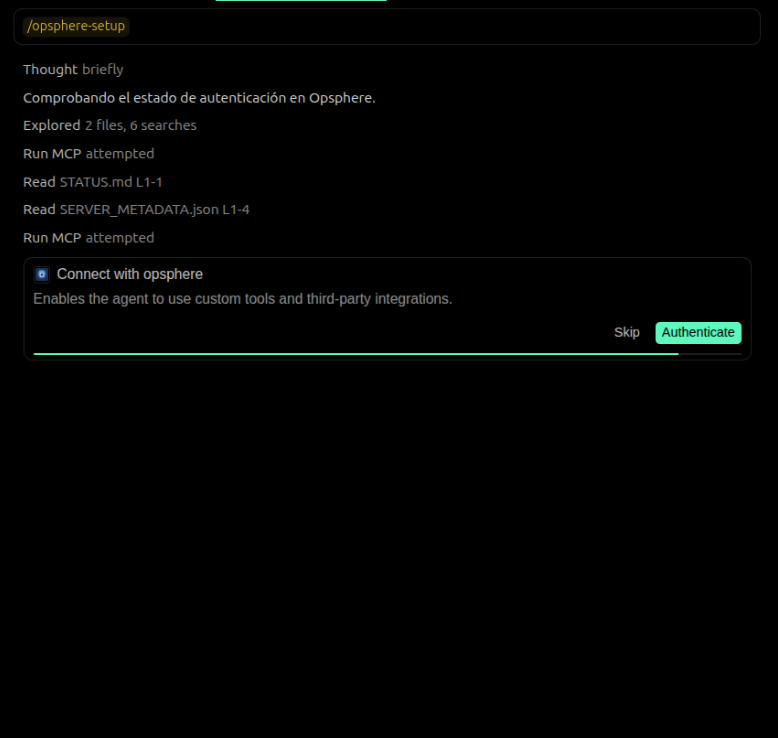
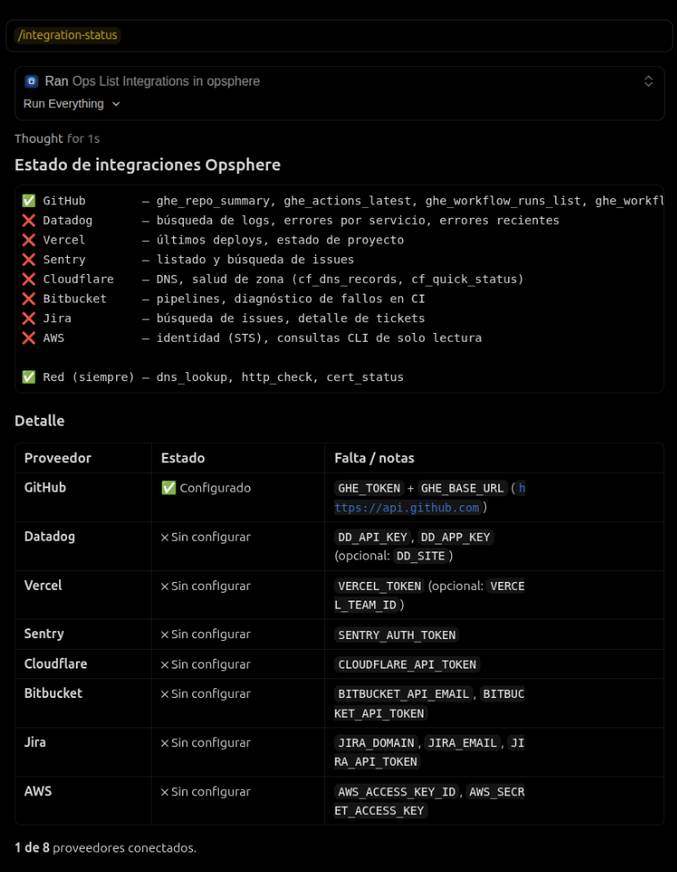
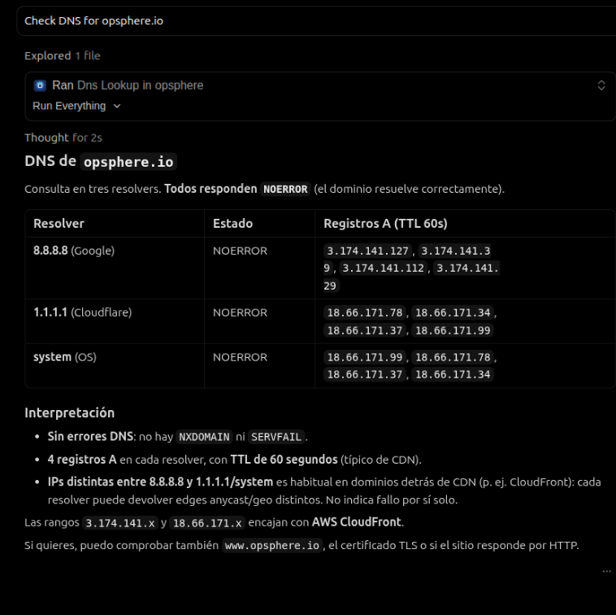

# Opsphere — DevOps Intelligence for Cursor

> Query logs, diagnose incidents, check deploys, and manage your infrastructure — without leaving the IDE.

[](https://github.com/opsphere-io/mcp-ops-plugin/releases)
[](LICENSE)
[](https://cursor.com)


---

## What is Opsphere?

Opsphere is a DevOps operational intelligence plugin for Cursor. It connects your monitoring, deployment, and issue-tracking tools to the AI agent so you can ask in natural language:

- _"Search Datadog logs for payment errors in the last hour"_
- _"What's failing in Sentry right now?"_
- _"Check DNS for mysite.com across all resolvers"_
- _"Diagnose the failed Bitbucket pipeline"_

Everything runs through a **secure remote MCP server**. No credentials are stored locally. No backend code is bundled in the plugin. Authentication uses OAuth2 + PKCE — Cursor manages the token automatically.

---

## Quick Start

1. **Install** Opsphere from the Cursor Marketplace.
2. **Connect**: click **Connect** next to Opsphere in **Cursor Settings → MCP**. A browser window opens — sign up (free, no card needed) or log in. Cursor stores the token automatically.
3. **Connect your tools**: say _"Configure my Datadog"_ — the agent asks for credentials and sets everything up.
4. **Start asking**: say _"Check DNS for mysite.com"_ or _"Show my Vercel deploys"_ — you're live.

> **Network tools** (`dns_lookup`, `http_check`, `cert_status`) work immediately after step 2 — no integration setup needed.

---

## How It Works

```
You (Cursor chat)
      │
      ▼
Opsphere MCP plugin          ← rules, skills, commands bundled here
      │   (OAuth2 token)
      ▼
Opsphere Gateway             ← validates token, routes tool calls
      │
      ├── Datadog API
      ├── Vercel API
      ├── GitHub / Bitbucket
      ├── Cloudflare
      ├── Jira / Sentry
      ├── AWS
      └── DNS / HTTP / TLS   ← always available, no credentials needed
```

---

## Supported Integrations

| Provider | What you can do | Credentials needed |
|---|---|---|
| **Datadog** | Search logs · count errors by service · check synthetics | API Key + App Key |
| **Vercel** | Latest deploys · project status · env vars | API Token |
| **GitHub** | Repo summary · Actions runs · PRs | Personal Access Token |
| **Bitbucket** | Pipeline list · pipeline diagnosis · PR search | App Password |
| **Cloudflare** | Zone status · DNS records · firewall events | API Token |
| **Jira** | Issue search · issue detail · comments | API Token |
| **Sentry** | Issues list · issue search · project stats | Auth Token |
| **AWS** | Identity check · read-only CLI queries | Access Key + Secret Key |
| **Network (built-in)** | DNS lookup · HTTP check · TLS cert · TCP | Nothing — always works |

> Full tool catalog on paid plans — including Kubernetes, ArgoCD, Azure Service Bus, Akamai, Confluence, and more.

---

## Example Prompts

| You say | What happens |
|---|---|
| `"Configure my Datadog"` | Guided setup: asks for API Key + App Key, configures and tests in one flow |
| `"Check DNS for example.com"` | Runs `dns_lookup` across Google, Cloudflare, and system resolvers |
| `"Is api.mycompany.com up?"` | Runs `http_check` + `cert_status` and reports status + cert expiry |
| `"Show my latest Vercel deploys"` | Lists the last 3 deployments with status, branch, and timestamp |
| `"Search Datadog logs for payment errors in the last hour"` | Queries Datadog Logs v2 with your filter |
| `"What's failing in Sentry right now?"` | Lists unresolved issues by severity |
| `"Diagnose the failed Bitbucket pipeline"` | Identifies the failed step and shows its log output |
| `"Find Jira issues assigned to me"` | Searches Jira with JQL and returns summaries |
| `"What GitHub Actions ran on main today?"` | Lists latest workflow runs with status |
| `"Show my usage"` | Displays plan, trial status, and daily tool calls |
| `"Which integrations do I have set up?"` | Lists configured vs. pending providers |

---

## Screenshots

<!-- Screenshots will be added in the next release. -->
<!-- To contribute screenshots, see docs/CONTRIBUTING.md -->

| | |
|---|---|
|  |  |
| *First-run setup via `/opsphere-setup` — OAuth login and first integration in under 2 minutes.* | *`/integration-status` — see which providers are active and what tools they unlock.* |
|  |  |
| *Live `dns_lookup` result across multiple resolvers.* | *`"What's failing in Sentry?"` returns grouped issues by severity.* |

> **Note**: Screenshots coming soon. The plugin is fully functional — images will be added in the next release.

---

## Free Plan

Opsphere includes a **30-day free trial** with no credit card required:

- **100 tool calls per day** (resets at midnight UTC)
- All **8 integrations** above (up to 2 tools per provider)
- **Network diagnostics** (`dns_lookup`, `http_check`, `cert_status`) — unlimited, no setup
- **`ops_my_usage`** — check plan status and daily usage at any time

After your trial, upgrade at [opsphere.io/pricing](https://opsphere.io/pricing) to unlock the full tool catalog (139 tools), unlimited daily calls, and premium providers.

---

## Security

- **OAuth2 Authorization Code + PKCE** — industry-standard authentication. You sign in via a browser window; Cursor manages the token automatically.
- **Encrypted per-tenant storage** — credentials are isolated per account; no cross-tenant access is possible.
- **HTTPS only** — no credentials are ever logged or returned to the plugin.
- **24-hour access tokens** — when one expires, Cursor shows the Connect button again; click it to renew in seconds.
- **No local storage** — no credentials are stored in Cursor or on your machine.
- **Open-source client** — the plugin (MIT). The backend is proprietary SaaS.

---

## Troubleshooting

<details>
<summary>No Connect button / tools not visible</summary>

- Open **Cursor Settings → MCP** and look for the Opsphere entry. If there is no Connect button, try reloading the window (`Cmd+Shift+P → Reload Window`).
- Check gateway reachability: `curl https://mcp-cursor.opsphere.io/health`
- If the gateway is down, check [status.opsphere.io](https://status.opsphere.io).

</details>

<details>
<summary>401 Unauthorized</summary>

- Your access token has expired (tokens last 24 hours).
- In **Cursor Settings → MCP**, click **Connect** to open a new browser sign-in window and renew automatically.

</details>

<details>
<summary>TRIAL_EXPIRED error</summary>

- Your 30-day free trial has ended.
- Upgrade at [opsphere.io/pricing](https://opsphere.io/pricing) to continue.
- Re-logging in will not fix this — it is a subscription state, not an auth issue.

</details>

<details>
<summary>RATE_LIMIT_EXCEEDED error</summary>

- You have reached your daily limit of 100 tool calls.
- The limit resets at midnight UTC.
- Say _"Show my usage"_ to check remaining calls via `ops_my_usage`.
- Upgrade at [opsphere.io/pricing](https://opsphere.io/pricing) for unlimited calls.

</details>

<details>
<summary>"Missing credentials" error for a tool</summary>

- The integration for that provider is not yet configured.
- Say _"Configure my [Provider]"_ and the agent will walk you through it.
- Run `/integration-status` to see which providers are connected.

</details>

See [docs/TROUBLESHOOTING.md](docs/TROUBLESHOOTING.md) for the full guide.

---

## Links

- **Website**: [opsphere.io](https://opsphere.io)
- **Pricing**: [opsphere.io/pricing](https://opsphere.io/pricing)
- **Status**: [status.opsphere.io](https://status.opsphere.io)
- **Support**: [hello@opsphere.io](mailto:hello@opsphere.io)
- **Docs**: [docs/](docs/)

---

## License

MIT — see [LICENSE](LICENSE).
