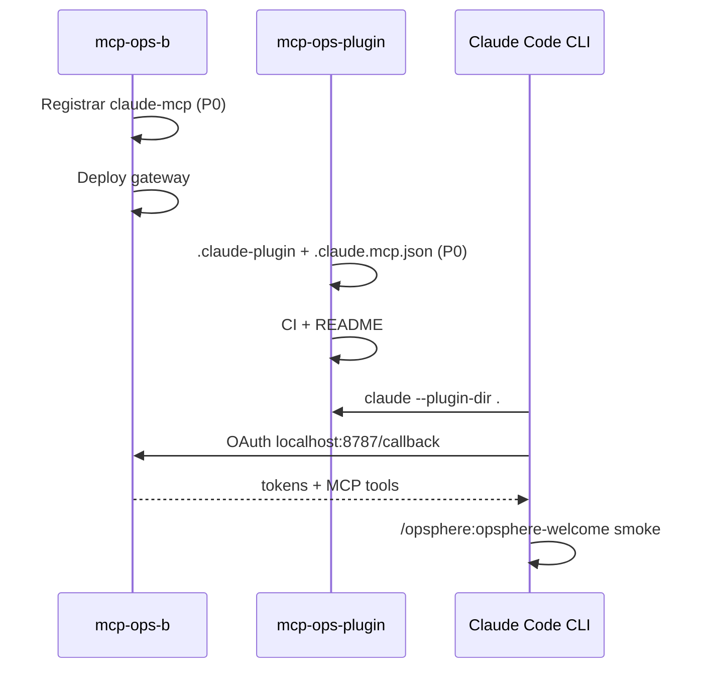

# Plugin Opsphere para Claude Code — plan de implementación

Documento operativo para añadir un **tercer host** al bundle `mcp-ops-plugin`, junto a Cursor (`.cursor-plugin/`) y Codex (`.codex-plugin/`). El plugin sigue siendo **markdown + JSON**; la ejecución y las credenciales viven en el gateway remoto `https://mcp-cursor.opsphere.io/mcp`.

**Referencias oficiales (Anthropic, 2026):**

- [Create plugins](https://code.claude.com/docs/en/plugins)
- [Plugins reference](https://code.claude.com/docs/en/plugins-reference)
- [Plugin marketplaces](https://code.claude.com/docs/en/plugin-marketplaces)
- [MCP en Claude Code](https://code.claude.com/docs/en/mcp) — OAuth, `type: http`, `callbackPort`

**Repositorios:**

| Repo | Responsable | Alcance |
|------|-------------|---------|
| `opsphere-io/opsphere-plugin` (`mcp-ops-plugin`) | Equipo plugin / producto | Manifest Claude, MCP JSON, skills, agents, CI, docs usuario |
| `mcp-ops-b` | Equipo gateway / backend | OAuth client estático, allowlist redirect, tests, telemetría |

---

## Resumen ejecutivo

| Aspecto | Estado hoy | Acción |
|---------|------------|--------|
| Track Cursor | ✅ Producción — manifest `1.0.11`, `mcp.json` + `cursor-mcp` | Sin cambios |
| Track Codex | ✅ Producción — manifest `1.0.7`, `.mcp.json` + `codex-mcp` | Sin cambios |
| Track Claude Code | ❌ **Cero implementación** (no existe `.claude-plugin/`) | Nuevo track completo |
| Gateway OAuth Claude | ⚠️ Parcial — redirect `localhost:8787/callback` ya permitido; falta `claude-mcp` en clientes estáticos | Cambio en `mcp-ops-b` |

**Orden de despliegue recomendado:** primero gateway (`mcp-ops-b`), luego plugin (`mcp-ops-plugin`), validación manual con `claude --plugin-dir`, después marketplace.

---

## Estado actual verificado (`mcp-ops-plugin`)

### Arquitectura

- Bundle **remoto**: no hay binarios ni scripts que se ejecuten al abrir el workspace.
- Gateway: `https://mcp-cursor.opsphere.io/mcp`
- Remotes Git: `origin` → fork interno; `official` → `opsphere-io/opsphere-plugin`

### Manifests existentes

| Host | Manifest | Versión | MCP config |
|------|----------|---------|------------|
| Cursor | `.cursor-plugin/plugin.json` | `1.0.11` | `mcp.json` → `auth.CLIENT_ID: cursor-mcp` |
| Codex | `.codex-plugin/plugin.json` | `1.0.7` | `mcpServers: ./.mcp.json` → `oauth.client_id: codex-mcp` |
| Claude | — | — | — |

### Contenido reutilizable (sin reestructurar carpetas)

| Directorio | Cantidad | Notas |
|------------|----------|-------|
| `skills/` | 11 skills (`SKILL.md`) | Auto-descubiertos por Claude en la raíz del plugin |
| `commands/` | 6 comandos legacy | Claude los carga igual que skills con namespace |
| `agents/` | 4 subagents | Ver frontmatter más abajo |
| `rules/onboarding-guide.mdc` | 1 regla always-on | **Solo Cursor** — no tiene equivalente en Claude |

### CI actual

`scripts/ci-validate.sh` valida **solo Cursor + Codex** (manifests, JSON, gateway URL, ausencia de `hooks/hooks.json`, invariantes UX). **No incluye Claude.**

---

## Cómo funciona un plugin Claude Code (doc oficial)

### Estructura de directorios

Solo `plugin.json` va dentro de `.claude-plugin/`. Todo lo demás va en la **raíz del plugin**:

```
mcp-ops-plugin/
├── .claude-plugin/
│   ├── plugin.json          # manifest (obligatorio si quieres metadata estable)
│   └── marketplace.json     # catálogo para distribución (opcional en dev)
├── .claude.mcp.json         # MCP Claude-specific (NUEVO — no usar .mcp.json de Codex)
├── skills/                  # ya existe
├── commands/                # ya existe
├── agents/                  # ya existe
├── .mcp.json                # Codex — NO tocar
├── mcp.json                 # Cursor — NO tocar
└── ...
```

**Error común (documentado por Anthropic):** poner `skills/`, `agents/` o `hooks/` **dentro** de `.claude-plugin/`. Solo va el manifest ahí.

### Namespace de invocación

El campo `name` del manifest es el prefijo de todo skill/agent del plugin:

- Skills/comandos: `/opsphere:<nombre>` (ej. `/opsphere:opsphere-welcome`)
- Subagents: `@opsphere:<nombre>` (ej. `@opsphere:outage-triage`)

### MCP en plugins

- Claude Code arranca los MCP del plugin al **habilitarlo**.
- Config en `.mcp.json` en la raíz **o** ruta custom vía `plugin.json` → `"mcpServers": "./.claude.mcp.json"`.
- Entrada HTTP **debe** incluir `"type": "http"` (alias aceptado: `"streamable-http"`).
- Sin `type`, Claude interpreta la entrada como stdio y **la ignora** con error explícito.

### Regla always-on

Claude **no** carga `CLAUDE.md` ni reglas embebidas del plugin como contexto persistente. Tampoco existe equivalente a `alwaysApply: true` de Cursor. Alternativas (en orden de preferencia para Opsphere):

1. Skill de onboarding con `description` fuerte + invocación explícita.
2. `SessionStart` hook con `additionalContext` — **descartado** en este bundle (evita shell local y race con MCP al arrancar).
3. `settings.json` → `"agent": "<subagent>"` — cambia el agente principal; demasiado invasivo.

---

## Incompatibilidad MCP: Codex vs Claude

El `.mcp.json` de Codex **no sirve** para Claude tal cual.

**Codex (actual — no modificar):**

```json
{
  "mcpServers": {
    "opsphere": {
      "url": "https://mcp-cursor.opsphere.io/mcp",
      "auth": "oauth",
      "http_headers": { "User-Agent": "codex-mcp/1.0" },
      "oauth_resource": "https://mcp-cursor.opsphere.io/mcp",
      "oauth": { "client_id": "codex-mcp" }
    }
  }
}
```

**Claude (objetivo — archivo nuevo `.claude.mcp.json`):**

```json
{
  "mcpServers": {
    "opsphere": {
      "type": "http",
      "url": "https://mcp-cursor.opsphere.io/mcp",
      "oauth": {
        "clientId": "claude-mcp",
        "callbackPort": 8787,
        "scopes": "mcp:tools"
      }
    }
  }
}
```

| Campo | Codex `.mcp.json` | Claude `.claude.mcp.json` |
|-------|-------------------|---------------------------|
| Transporte | inferido por `url` | **`"type": "http"` obligatorio** |
| OAuth client | `oauth.client_id` (snake_case) | `oauth.clientId` (camelCase) |
| Callback | dinámico Codex (`/callback/<id>`) | fijo `http://localhost:PORT/callback` vía `callbackPort` |
| Scopes | array en Cursor; implícito en Codex | **string** separado por espacios en `oauth.scopes` |
| Headers / resource | `http_headers`, `oauth_resource` | no necesarios — discovery RFC 9728/8414 automático |

### Conflicto con `.mcp.json` en la raíz

El repo ya tiene `.mcp.json` para Codex. El manifest Claude **debe** apuntar explícitamente a `.claude.mcp.json` y el CI debe comprobar que **nunca** referencia `.mcp.json` de Codex.

### OAuth callback — alinear con gateway (importante)

Según la [doc MCP de Claude Code](https://code.claude.com/docs/en/mcp):

- Redirect registrado: `http://localhost:PORT/callback`
- `callbackPort` fija el puerto cuando el AS exige URI pre-registrada

En `mcp-ops-b` (`oauth-redirect.ts`) **ya están permitidos**:

- `http://localhost:8787/callback`
- `http://127.0.0.1:8787/callback`

Los tests confirman que `http://localhost:9999/callback` **falla**. Por tanto:

- ✅ Usar **`callbackPort: 8787`** en el plugin Claude
- ❌ **No** usar `8788` (como sugería un borrador anterior del doc)

El redirect probablemente **no** requiere cambios en gateway si se usa puerto 8787. Sí hace falta registrar el **client_id** `claude-mcp` (ver sección gateway).

---

## Tabla comparativa Cursor / Codex / Claude

| Concepto | Cursor | Codex | Claude Code |
|----------|--------|-------|-------------|
| Manifest | `.cursor-plugin/plugin.json` | `.codex-plugin/plugin.json` | `.claude-plugin/plugin.json` |
| Marketplace | `.cursor-plugin/marketplace.json` | `.agents/plugins/marketplace.json` | `.claude-plugin/marketplace.json` |
| MCP config | `mcp.json` | `.mcp.json` | `.claude.mcp.json` (vía manifest) |
| OAuth client | `cursor-mcp` | `codex-mcp` | `claude-mcp` (nuevo) |
| Skill invoke | `/opsphere-welcome` | `@opsphere-welcome` | `/opsphere:opsphere-welcome` |
| Agent invoke | `/outage-triage` | `@incident-investigation` | `@opsphere:outage-triage` |
| Conectar MCP | Tarjeta plugin / Settings → Extensions | OAuth al instalar / `codex mcp login` | `/mcp` o `claude mcp login opsphere` |
| Recargar cambios | Reload Window | nueva tarea Codex | `/reload-plugins` |
| Regla always-on | `rules/onboarding-guide.mdc` | no (solo `defaultPrompt` en manifest) | no — skill onboarding |

---

## Trabajo en `mcp-ops-plugin` (equipo plugin)

> **Dependencia:** el gateway debe aceptar `client_id: claude-mcp` antes de probar OAuth end-to-end. Redirect en 8787 ya debería funcionar.

### P0 — Bloqueantes para primer login OAuth

- [ ] **Crear `.claude-plugin/plugin.json`**

```json
{
  "name": "opsphere",
  "displayName": "Opsphere — DevOps & SRE Intelligence",
  "version": "1.0.0",
  "description": "DevOps and SRE intelligence for Claude Code via a remote MCP gateway.",
  "author": {
    "name": "Opsphere",
    "email": "contact@opsphere.io"
  },
  "homepage": "https://opsphere.io",
  "repository": "https://github.com/opsphere-io/opsphere-plugin",
  "license": "MIT",
  "keywords": ["devops", "sre", "mcp", "incident-triage", "datadog", "opsphere"],
  "mcpServers": "./.claude.mcp.json"
}
```

Notas:

- Versión **independiente** de Cursor (`1.0.11`) y Codex (`1.0.7`).
- `name: opsphere` → namespace `/opsphere:…` y `@opsphere:…`.
- Considerar `"defaultEnabled": false` en la entrada del marketplace (opt-in explícito para SaaS externo).

- [ ] **Crear `.claude.mcp.json`** (contenido arriba; `callbackPort: 8787`, `clientId: claude-mcp`).

- [ ] **Extender `scripts/ci-validate.sh`**
  - Existe y parsea `.claude-plugin/plugin.json`
  - Existe y parsea `.claude.mcp.json`
  - `mcpServers` del manifest apunta a `.claude.mcp.json` (no a `.mcp.json`)
  - URL gateway = `https://mcp-cursor.opsphere.io/mcp`
  - `"type": "http"` presente
  - `oauth.clientId` = `claude-mcp`
  - `oauth.callbackPort` = `8787`

- [ ] **Actualizar `README.md`** — sección Claude: install, `/mcp`, `claude mcp login`, namespace skills.

- [ ] **Entrada en `CHANGELOG.md`** — track Claude `1.0.0`.

### P1 — Calidad y UX

- [ ] **Skill de onboarding** — `skills/opsphere-onboarding/SKILL.md` (condensado de `rules/onboarding-guide.mdc`: catálogo tools, códigos error, Connection Hub, presentación de respuestas).

- [ ] **Frontmatter agents** — quitar `readonly: true` (campo Cursor; Claude lo ignora/advierte con `--strict`):

| Agent | `readonly` actual | Acción Claude |
|-------|-------------------|---------------|
| `outage-triage` | `true` | Quitar; opcional `disallowedTools: Write, Edit, Bash` |
| `endpoint-health` | `true` | Igual |
| `ci-investigator` | `true` | Igual |
| `postmortem-writer` | **`false`** | Mantener sin `readonly`; puede usar `memory_store` |

- [ ] **Copy host-specific** en `commands/*.md` (y welcome/setup):
  - Cursor → `/opsphere-welcome`, Settings → Extensions
  - Codex → `@skill-name`
  - Claude → `/opsphere:opsphere-welcome`, `/mcp`, `claude mcp login opsphere`, `/reload-plugins`

- [ ] **Crear `.claude-plugin/marketplace.json`**

```json
{
  "name": "opsphere",
  "owner": {
    "name": "Opsphere",
    "email": "contact@opsphere.io"
  },
  "plugins": [
    {
      "name": "opsphere",
      "source": "./",
      "description": "DevOps & SRE intelligence for Claude Code",
      "version": "1.0.0"
    }
  ]
}
```

Install para usuarios:

```bash
claude plugin marketplace add opsphere-io/opsphere-plugin
claude plugin install opsphere@opsphere
```

### P2 — Distribución y docs

- [ ] Validación local antes de PR:

```bash
claude plugin validate . --strict
claude --plugin-dir .
/reload-plugins
/opsphere:opsphere-welcome
/mcp
claude mcp login opsphere   # si hace falta re-auth desde shell
```

- [ ] Docs instalación/troubleshooting Claude (equivalente a Cursor/Codex en `docs/`).
- [ ] (Opcional) Submission marketplace comunitario Anthropic / directorio `claude.ai`.

### Prohibido en este repo (invariantes existentes)

| No hacer | Motivo |
|----------|--------|
| Editar `.mcp.json` de Codex | Rompe track Codex |
| Editar `mcp.json` de Cursor | Rompe track Cursor |
| Añadir `hooks/hooks.json` | CI lo prohíbe; shell automático al abrir workspace |
| LSP, monitors, `bin/` | No aplica a bundle markdown+JSON remoto |

---

## Trabajo en `mcp-ops-b` (equipo gateway)

> **Bloqueante para OAuth Claude:** sin `claude-mcp` en clientes estáticos, el authorize fallará aunque el redirect sea válido.

### P0 — OAuth client Claude

**Archivo:** `src/gateway/oauth-dcr.ts`

```typescript
export const STATIC_OAUTH_CLIENT_IDS = new Set([
  'cursor-mcp',
  'codex-mcp',
  'claude-mcp',   // ← añadir
  'slack-mcp',
]);
```

**Verificar redirect (probablemente sin cambio):**

`src/gateway/oauth-redirect.ts` ya incluye en `REDIRECT_URI_EXACT`:

- `http://localhost:8787/callback`
- `http://127.0.0.1:8787/callback`

Claude Code usa `http://localhost:8787/callback` cuando `callbackPort: 8787`. **Confirmar en el primer OAuth real**; solo añadir URIs extra si Claude envía un patrón distinto.

**Tests a actualizar/añadir:**

| Archivo | Qué añadir |
|---------|------------|
| `tests/test-oauth-login.ts` | `claude-mcp` aceptado como client estático |
| `tests/test-oauth-mcp-discovery.ts` | authorize con `client_id=claude-mcp` + redirect `http://localhost:8787/callback` |
| `tests/test-oauth-refresh-telemetry.ts` | (opcional) perfil para `claude-mcp` |

### P1 — Telemetría y runtime profile (opcional)

**Archivo:** `src/gateway/oauth-refresh-telemetry.ts`

Hoy `oauthRefreshClientProfile()` mapea:

- contiene `codex` → `codex`
- contiene `cursor` → `cursor`
- resto → `other`

`claude-mcp` cae en **`other`** (no bloqueante). Opcional: añadir rama `claude` si queréis dashboards separados.

**Archivo:** `src/gateway/oauth-redirect.ts` — `oauthRuntimeProfileFromRedirectUri()`

Un callback `http://localhost:8787/callback` (sin sufijo Codex) devuelve **`cursor`**. Probablemente correcto para JWT/runtime profile de tools; documentar decisión. Solo cambiar si producto exige perfil `claude` distinto.

### P2 — Despliegue gateway

1. Merge PR `mcp-ops-b` con `claude-mcp`.
2. Deploy gateway a entorno donde probéis (TST/PRE/prod según proceso Opsphere).
3. Smoke OAuth manual con plugin en `--plugin-dir` **después** del deploy.

### Checklist gateway (copiar en PR)

```
[ ] STATIC_OAUTH_CLIENT_IDS incluye claude-mcp
[ ] Tests OAuth verdes (login + discovery)
[ ] Smoke: authorize con redirect_uri=http://localhost:8787/callback
[ ] Smoke: token exchange + tools/list con client claude-mcp
[ ] (Opcional) telemetría refresh profile claude
```

---

## Coordinación entre equipos



| Hito | Owner | Criterio de done |
|------|-------|------------------|
| Gateway acepta `claude-mcp` | ops-b | Tests CI verdes + authorize manual OK |
| Plugin Claude P0 | plugin | `claude plugin validate . --strict` OK |
| E2E OAuth | ambos | `/mcp` connected + `ops_my_usage` responde |
| Marketplace | plugin | `plugin marketplace add` + install desde GitHub |

---

## Campos Cursor/Codex sin equivalente Claude

No copiar estos campos al manifest Claude; `claude plugin validate --strict` los marcará como desconocidos:

| Item | Origen | Sustituto Claude |
|------|--------|------------------|
| `alwaysApply` rule | `rules/onboarding-guide.mdc` | Skill onboarding |
| `readonly` en agents | `agents/*.md` | `disallowedTools` o instrucciones en cuerpo |
| `tags`, `category`, `logo` | `.cursor-plugin/plugin.json` | solo `keywords`; sin icono en schema plugin |
| Bloque `interface.*` | `.codex-plugin/plugin.json` | campos planos (`displayName`, `homepage`) |
| `defaultPrompt` | Codex manifest | no existe — documentar en skill welcome |
| `auth.CLIENT_ID` | Cursor `mcp.json` | `oauth.clientId` + `type: http` |
| `policy` en marketplace | Codex `.agents/plugins/` | schema Claude distinto |

---

## Validación final (checklist QA)

```bash
# En mcp-ops-plugin (después de gateway desplegado)
npm test                                    # ci-validate Cursor+Codex+Claude
claude plugin validate . --strict
claude --plugin-dir .
# Dentro de Claude Code:
/reload-plugins
/mcp                                        # opsphere → Connected (o Needs authentication → login)
/opsphere:opsphere-welcome
@opsphere:outage-triage                     # smoke subagent (plan Community → upgrade message esperado)
```

**Criterios de éxito:**

1. MCP `opsphere` conecta sin error de redirect URI mismatch.
2. Skills namespaced responden (`/opsphere:…`).
3. Subagents visibles en typeahead `@opsphere:…`.
4. `npm test` incluye checks Claude sin regresión Cursor/Codex.
5. No hay `hooks/hooks.json` nuevo ni cambios en `.mcp.json` / `mcp.json` legacy.

---

## Referencias internas

- Regla always-on Cursor: `rules/onboarding-guide.mdc`
- CI plugin: `scripts/ci-validate.sh`, `scripts/phase6-ux-invariants.mjs`
- Gateway redirect: `mcp-ops-b/src/gateway/oauth-redirect.ts`
- Gateway clientes: `mcp-ops-b/src/gateway/oauth-dcr.ts`
- Tests redirect: `mcp-ops-b/tests/test-oauth-login.ts`, `tests/test-oauth-mcp-discovery.ts`

---

*Última revisión: 2026-08-21 — alineado con doc Anthropic Claude Code plugins/MCP y estado del repo `mcp-ops-plugin` / `mcp-ops-b`.*
