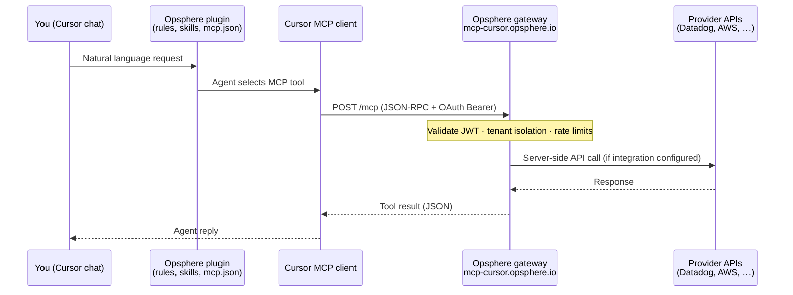

# Remote MCP architecture

Opsphere for Cursor is a **thin client** plugin. **All MCP tool execution runs on the Opsphere gateway** — not on your machine. This repository ships only rules, skills, commands, and `mcp.json`; there is no opaque bytecode or hidden backend in the bundle.

---

## Design intent

| Layer | What it is | Runs where |
|-------|------------|------------|
| **Plugin (this repo)** | Markdown + JSON manifest; agent guidance | Cursor (local) |
| **Opsphere gateway** | OAuth, auth, tool routing, credential vault, rate limits | `mcp-cursor.opsphere.io` (remote SaaS) |
| **Provider APIs** | Datadog, Vercel, AWS, GitHub, etc. | Called **from the gateway only** |

Same trust model as other **authenticated remote MCP servers**: you delegate API access to a hosted service. Opsphere centralizes multiple providers behind one gateway instead of installing separate MCP servers per vendor.

---

## Request flow



**OAuth (first connect):**

```mermaid
sequenceDiagram
  participant User as You
  participant Cursor as Cursor
  participant GW as mcp-cursor.opsphere.io

  User->>Cursor: Click Connect (MCP settings)
  Cursor->>GW: OAuth 2.0 + PKCE
  GW->>User: Browser sign-up / login
  GW-->>Cursor: Access + refresh tokens
  Note over Cursor: Tokens stored by Cursor;<br/>not in plugin files
```

---

## Network endpoints

### Opsphere (plugin connects here)

| Host | Paths | Protocol | Purpose |
|------|-------|----------|---------|
| **`mcp-cursor.opsphere.io`** | `/mcp` | HTTPS | **Single MCP endpoint** (all tool calls) |
| same | `/oauth/authorize`, `/oauth/token`, `/.well-known/oauth-authorization-server` | HTTPS | Cursor OAuth Connect |
| same | `/health` | HTTPS | Gateway health check |
| same | `/api/plugin/*` | HTTPS | Legacy signup/login (optional; OAuth is primary) |

Configured in [`mcp.json`](../mcp.json):

```json
{
  "mcpServers": {
    "opsphere": {
      "url": "https://mcp-cursor.opsphere.io/mcp",
      "auth": { "CLIENT_ID": "cursor-mcp" }
    }
  }
}
```

**There is no other MCP URL in this plugin.** Cursor talks only to `mcp-cursor.opsphere.io` for Opsphere tools.

### Informational (not MCP traffic)

| Host | Purpose |
|------|---------|
| [opsphere.io](https://opsphere.io) | Product site, [privacy](https://opsphere.io/privacy), [terms](https://opsphere.io/terms), [pricing](https://opsphere.io/pricing) |
| [status.opsphere.io](https://status.opsphere.io) | Service status |

### Third-party (gateway outbound only)

When you configure an integration, the **gateway** calls provider APIs (e.g. `api.datadoghq.com`, `api.vercel.com`, `api.github.com`). The plugin bundle **never** contacts these domains directly — no SDKs, no API clients, no embedded endpoints.

---

## What is in the bundle (auditable)

| Included | Not included |
|----------|--------------|
| `rules/`, `skills/`, `commands/` (Markdown) | Tool implementation code |
| `mcp.json` (one remote URL) | OAuth secrets or API keys |
| `.cursor-plugin/*.json` (manifest) | Pre/post install scripts |
| `scripts/ci-validate.sh` (CI only) | Compiled binaries |
| CI: [`.github/workflows/ci.yml`](../.github/workflows/ci.yml) (validate + Gitleaks) | Hidden network clients / exfiltration |

Everything in the [public GitHub repo](https://github.com/impactotecnologico/mcp-ops-plugin) is readable Markdown or JSON. **No opaque code.** Automated checks on every push confirm no secrets, no install hooks, and no exfiltration patterns in the bundle (`npm test` + Gitleaks).

---

## Trust comparison (for reviewers)

| Approach | Where secrets live | Where tools run |
|----------|-------------------|-----------------|
| Local Datadog CLI + agent | Your machine | Your machine |
| Remote MCP per vendor (N servers) | N hosted services | N hosted services |
| **Opsphere (this plugin)** | One gateway (encrypted, per-tenant) | **One gateway** (`mcp-cursor.opsphere.io`) |

Risk profile: equivalent to using **any authenticated remote MCP** that proxies cloud APIs — consolidated rather than fragmented. Users who require all tooling to run locally should not install remote MCP plugins.

See also: [SECURITY.md](../SECURITY.md) · [docs/SECURITY-AND-TRUST.md](SECURITY-AND-TRUST.md) · [docs/PRIVACY.md](PRIVACY.md)
