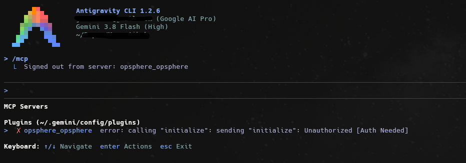
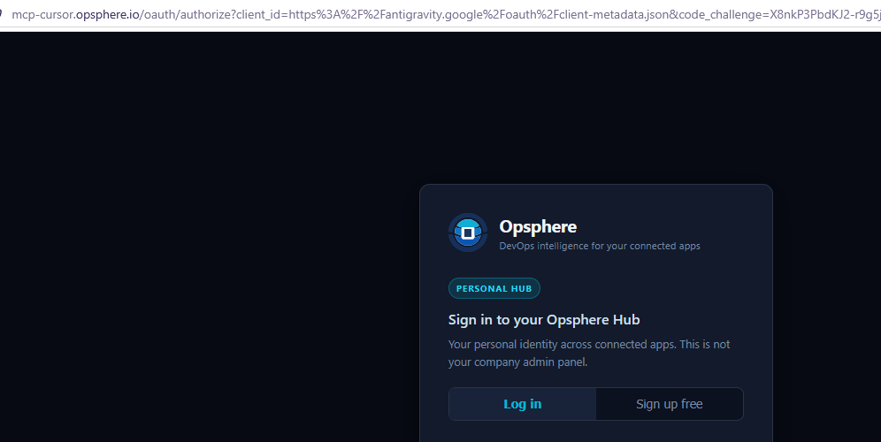
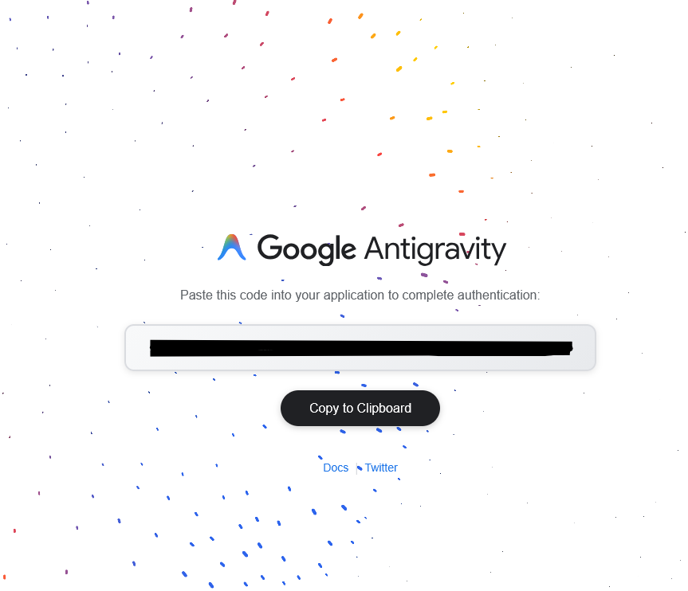
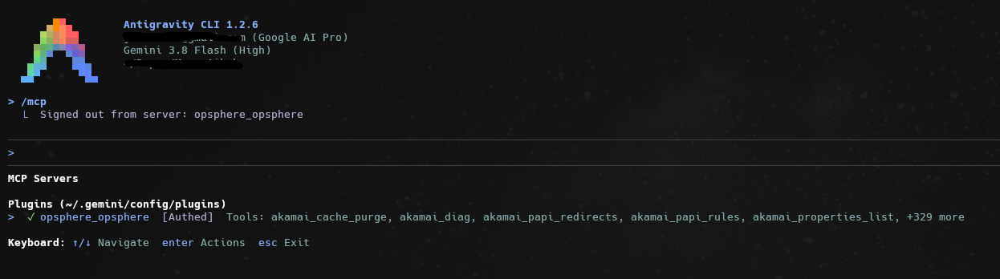
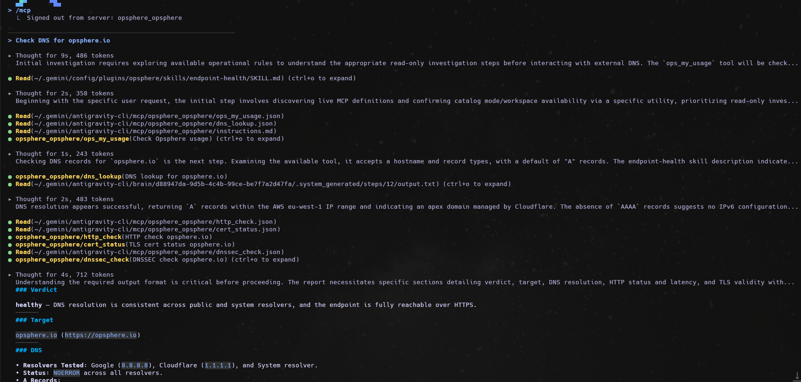
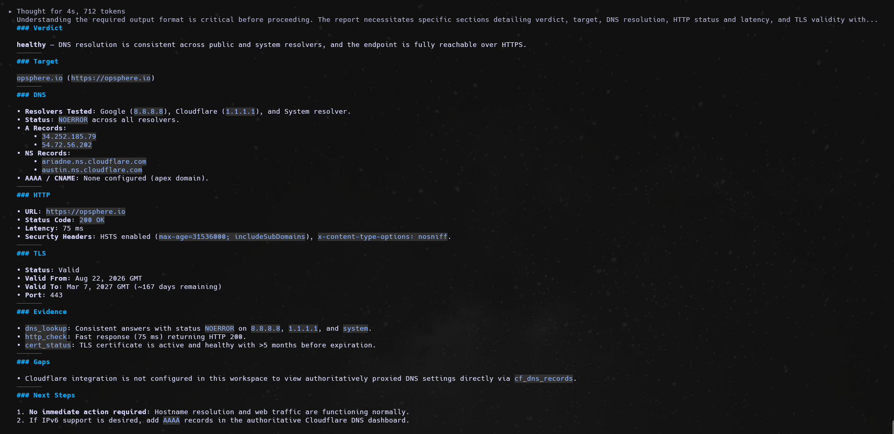

# Opsphere for Antigravity

Use the [official generated Antigravity connection guide](guides/antigravity.md) for the endpoint, native `mcp_config.json`, Agent Plugins `mcp.json`, CIMD OAuth, plan compatibility and troubleshooting. The guide is generated from the canonical connection catalog.

Package version **1.0.0**. This folder does not change the Cursor, Codex or Claude Code plugin bundles.

## Obtain the package

Follow the public package availability check in the guide before downloading. MCP-only setup needs no package. This folder adds Antigravity plugin files (`plugin.json`, `mcp_config.json`, `mcp.json`), skills and agents. No credentials are included.

## Install (plugin)

Current `agy` **1.2.x** (verified against 1.2.3). Choose **one** of the two options below.

### Install from the public repo

Uses this folder (`opsphere-antigravity/`) of `https://github.com/opsphere-io/opsphere-plugin`, not the repo root:

```sh
agy plugin install https://github.com/opsphere-io/opsphere-plugin/tree/main/opsphere-antigravity
agy plugin validate ~/.gemini/config/plugins/opsphere
```

### Install from a local copy

From a clone or extracted copy of this folder:

```sh
agy plugin install /absolute/path/to/opsphere-antigravity
agy plugin validate ~/.gemini/config/plugins/opsphere
```

### After installing

Official install path: `~/.gemini/config/plugins/opsphere/`. Validate must report `mcpServers` processed. On current `agy`, the same output also reports skills and agents processed, and `agy plugin list` includes `mcpServers`.

Then start a **new** `agy` session. Do not enable a second MCP entry named `opsphere` while the plugin is installed. Do not install from the bare repo-root URL `https://github.com/opsphere-io/opsphere-plugin`: live `agy` 1.2.3 treats that as this whole monorepo (the Cursor/Claude bundle), not this folder. Always include the `/tree/main/opsphere-antigravity` path.

`.agents/plugins/opsphere/` and `~/.gemini/antigravity-cli/plugins/opsphere/` are experimental and unsupported. Google docs may still cite the `antigravity-cli` path; use `~/.gemini/config/plugins/opsphere/` on current `agy`.

## OAuth (CIMD)

Expected identity (do not configure these yourself):

- `client_id`: `https://antigravity.google/oauth/client-metadata.json`
- callback: `https://antigravity.google/oauth-callback`

Flow: Antigravity discovers OAuth, uses the CIMD client_id, starts PKCE S256, opens the browser. Sign in with the same email as your other Opsphere clients and choose a workspace. If Antigravity asks for a code, paste the **one-time** authorization code into the terminal. Do not log, share or document that code. Workspace preference is bound to this stable CIMD client_id; Antigravity does not create a new `dcr_*` client per install.

## MCP-only (exclusive)

Add the same gateway as `serverUrl` in `~/.gemini/config/mcp_config.json` (global) or `.agents/mcp_config.json` (workspace). Do not use this package's Agent Plugins `mcp.json` there. Do not install the plugin at the same time.

## Package contents

- `plugin.json`
- `mcp_config.json` (`serverUrl` only) — this is what current agy loads
- `mcp.json` (`type: streamable-http`, gateway `url` only) — Agent Plugins portable; ignored by agy 1.2.x
- `skills/`
- `agents/` — current agy 1.2.x processes these

OAuth, credentials, `client_id`, callback, tokens and secrets are **not** in the plugin. Antigravity discovers OAuth and uses stable CIMD.

`commands/` are omitted: current agy converts plugin commands to skills unreliably; invoke the matching skill. `rules/` ship with the plugin layout; validate does not report them.

## Why MCP can look empty after install

Current `agy` (1.2.x) loads plugin MCP from `mcp_config.json` with `serverUrl`. It does **not** ingest Agent Plugins `mcp.json`. If `agy plugin list` shows Opsphere but a new session has an empty MCP section, the installed plugin is missing `mcp_config.json`. Confirm with:

```sh
agy plugin validate /absolute/path/to/opsphere-antigravity
```

That output must include `mcpServers : 1 processed`. Then start a **new** `agy` session.

## Uninstall

```sh
agy plugin uninstall opsphere
```

Local removal does not revoke the server session or delete your account.

## First run

See [local examples](examples/local.md). Do not copy OAuth files from Cursor, Codex, Claude Code, Warp or OpenCode.

## Screenshots

### Sign in (common to all clients)

Every Opsphere client opens the same browser sign-in page during OAuth.

| | |
|---|---|
|  |  |
| *Sign in with your existing account — browser-based OAuth2.* | *New user? Create a free account in seconds — no credit card required.* |

### Antigravity in action

Captured with Antigravity CLI 1.2.6 after `agy plugin install`.

**1. Start a new session and run `/mcp`.** Before you sign in, the plugin's server `opsphere_opsphere` is listed under **Plugins** as `Unauthorized [Auth Needed]`.



**2. Sign in in the browser.** Antigravity opens the Opsphere authorize page with its stable CIMD client id (`https://antigravity.google/oauth/client-metadata.json`). Log in, or choose **Sign up free**.



**3. Copy the one-time code.** After you sign in, Google Antigravity shows a one-time authorization code. Paste it into the terminal. Never share or document this code; it is redacted here.



**4. Check `/mcp` again.** `opsphere_opsphere` now shows `[Authed]` with its tool list.



**5. Ask a first question:** `Check DNS for opsphere.io`. The agent loads the `endpoint-health` skill, then calls `ops_my_usage`, `dns_lookup`, `http_check`, `cert_status` and `dnssec_check`. All are read-only.



**6. Read the report.** The result is a structured verdict with the target, DNS, HTTP, TLS, evidence, gaps and next steps.



## Testing

Maintainer and reviewer steps: [docs/ANTIGRAVITY-TEST-CASES.md](../docs/ANTIGRAVITY-TEST-CASES.md). CI validates the package files. Live `agy` OAuth is a manual matrix and must not be marked passed without execution.
