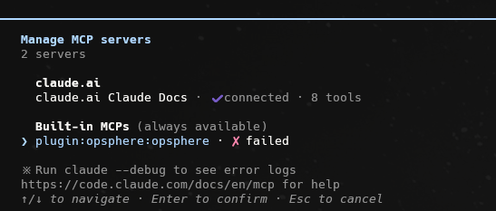
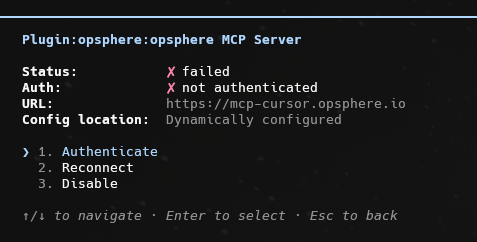
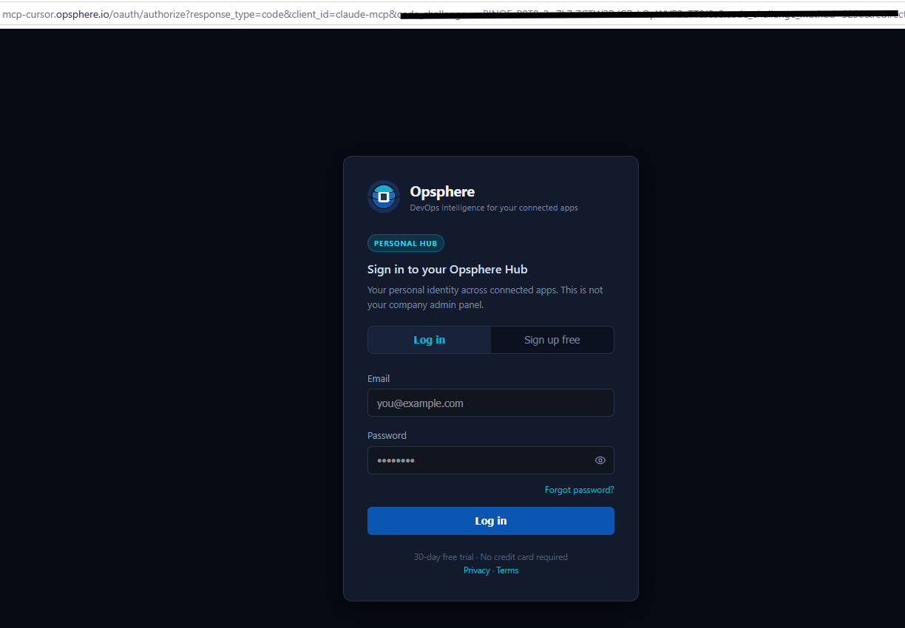
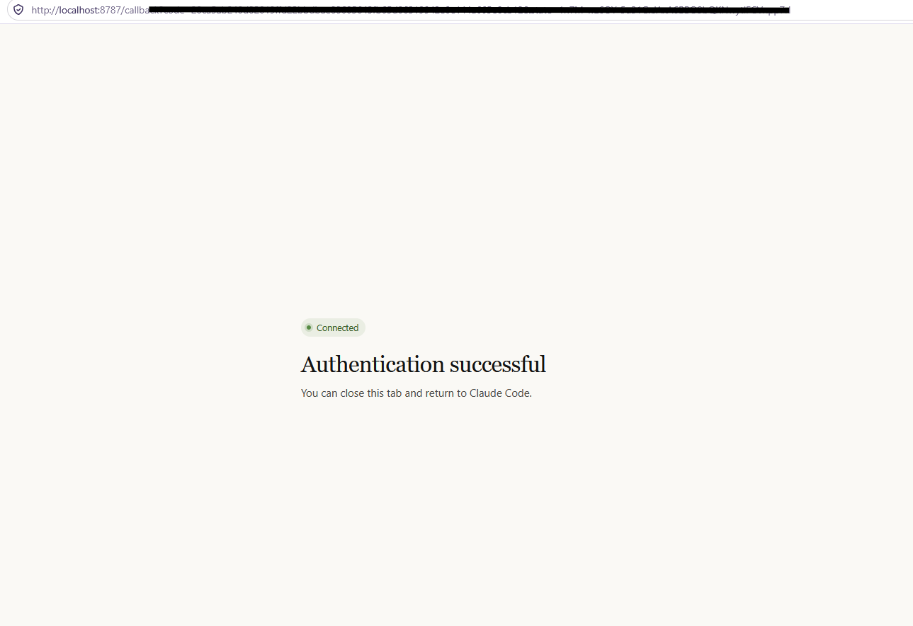
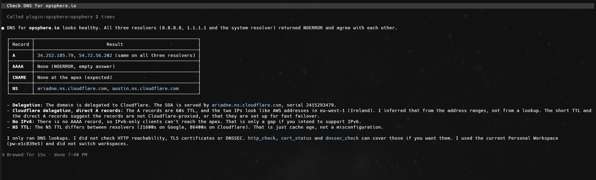

# Opsphere for Claude Code

Opsphere connects Claude Code to your monitoring, deployment and issue-tracking stack through the same secure remote MCP gateway (`https://mcp-cursor.opsphere.io/mcp`) used by every other Opsphere client. Tool execution and credential storage run on the gateway.

Package version: see `version` in [`.claude-plugin/plugin.json`](../.claude-plugin/plugin.json). It is independent from the Cursor, Codex and other client versions.

## This folder is documentation only

Claude Code installs the plugin from the **repository root**, not from this folder. There is no manifest here and there must not be one: `.claude-plugin/marketplace.json` uses `source: ./`, so the plugin root is the repo root. Do not point Claude `source` at a nested directory, and do not nest a Claude manifest under [`plugins/opsphere/`](../plugins/opsphere/), which is the generated Cursor package.

Files that make up the Claude Code plugin, all at the repo root:

- [`.claude-plugin/plugin.json`](../.claude-plugin/plugin.json): plugin manifest (name `opsphere`, which namespaces skills and agents).
- [`.claude-plugin/marketplace.json`](../.claude-plugin/marketplace.json): marketplace catalog (`source: ./`).
- [`.claude.mcp.json`](../.claude.mcp.json): MCP config (`type: http`, gateway `url`, camelCase `oauth.clientId`). It is **not** compatible with Codex's `.mcp.json`.
- [`skills/`](../skills/), [`agents/`](../agents/) and [`commands/`](../commands/): skills, subagents and slash commands.

No credentials are included.

## Install from the public repo

Uses the repo root of `https://github.com/opsphere-io/opsphere-plugin`:

```sh
claude plugin marketplace add opsphere-io/opsphere-plugin
claude plugin install opsphere@opsphere
```

Then start a **new** Claude Code session. Inside Claude Code:

```text
/reload-plugins
/mcp
/opsphere:opsphere-welcome
```

In `/mcp` the plugin's server is named `plugin:opsphere:opsphere`. Until you sign in it is listed as `failed` (not authenticated); see [Claude Code in action](#claude-code-in-action) below to authenticate it.

## Install from source

For local testing without installing, from a clone of the public repo:

```sh
git clone https://github.com/opsphere-io/opsphere-plugin.git
cd opsphere-plugin
claude --plugin-dir .
```

Run `/reload-plugins` after pulling changes.

## OAuth

OAuth 2.0 + PKCE is managed by Claude Code against the gateway. Sign in with the same email as your other Opsphere clients and choose a workspace. `.claude.mcp.json` sets the static client id `claude-mcp` and callback port `8787`; do not configure tokens or secrets yourself. Each client gets its own revocable session; never copy token files between applications.

To sign in again from the shell, use the plugin's full server name (`claude mcp list` shows it):

```sh
claude mcp login plugin:opsphere:opsphere
```

The short name `opsphere` only works for the MCP-only setup below.

## Using skills and subagents

The manifest name `opsphere` namespaces everything:

| Concept | Claude Code |
|---------|-------------|
| Skill | `/opsphere:opsphere-welcome` |
| Subagent | `@opsphere:outage-triage` |
| Connect MCP | `/mcp` or `claude mcp login plugin:opsphere:opsphere` |
| Reload after edits | `/reload-plugins` |

Claude Code has no always-on rule mechanism (unlike Cursor's `rules/onboarding-guide.mdc`). The closest substitute is [`skills/opsphere-onboarding/SKILL.md`](../skills/opsphere-onboarding/SKILL.md), invoked with `/opsphere:opsphere-onboarding`.

## MCP-only (no plugin)

If you only want the tools and not the skills, agents or commands:

```sh
claude mcp add --transport http opsphere https://mcp-cursor.opsphere.io/mcp \
  --client-id claude-mcp --callback-port 8787
```

The two flags mirror the OAuth settings in [`.claude.mcp.json`](../.claude.mcp.json). Then run `/mcp` and sign in. Do not use this together with the plugin: keep a single MCP entry named `opsphere`.

## Uninstall

```sh
claude plugin uninstall opsphere@opsphere
claude plugin marketplace remove opsphere
```

Local removal does not revoke the server session or delete your account, integrations, workspace or subscription. Removing an integration is not client-session revocation either; see [multiclient recovery](../docs/MULTICLIENT-SUPPORT.md).

## First run

After installing and signing in, ask Claude Code:

- “Use `/opsphere:opsphere-onboarding` to show my plan and active workspace. Do not change anything.”
- “Use `@opsphere:endpoint-health` to check https://example.com. Read-only; do not change infrastructure.”
- “Use `/opsphere:configure-integration` to show whether I can connect Datadog here. Do not collect secrets in chat.”

Do not copy OAuth files from Cursor, Codex, Warp, OpenCode, Antigravity or Copilot.

## Screenshots

### Sign in (common to all clients)

Every Opsphere client opens the same browser sign-in page during OAuth.

| | |
|---|---|
|  |  |
| *Sign in with your existing account — browser-based OAuth2.* | *New user? Create a free account in seconds — no credit card required.* |

### Claude Code in action

**1. Install the plugin** from the public repo, then start a **new** Claude Code session (or run `/reload-plugins`):

```sh
claude plugin marketplace add opsphere-io/opsphere-plugin
claude plugin install opsphere@opsphere
```

**2. Run `/mcp`.** The plugin's server is listed as `plugin:opsphere:opsphere`. Before you sign in it shows `✗ failed`, which here just means it is not authenticated yet.



**3. Open the server and choose Authenticate.** The details show `Status: failed`, `Auth: not authenticated` and the gateway URL. Select **1. Authenticate**.



**4. Sign in in the browser.** Claude Code opens the Opsphere authorize page with the static client id `claude-mcp` (the value pinned in `.claude.mcp.json`). Log in, or choose **Sign up free**. The address bar contains a PKCE challenge and is redacted here.



**5. Return to Claude Code.** The browser lands on `http://localhost:8787/callback` (the callback port pinned in `.claude.mcp.json`) and says **Authentication successful. You can close this tab and return to Claude Code.** The address bar carries the authorization response, so it is redacted here; do not share it.



**6. Ask a first question:** `Check DNS for opsphere.io`. Claude calls the Opsphere tools (`Called plugin:opsphere:opsphere 2 times`, read-only) and summarizes the A, AAAA, CNAME and NS records with a short assessment.



## More

- Full plugin notes: [docs/CLAUDE-CODE-PLUGIN.md](../docs/CLAUDE-CODE-PLUGIN.md)
- Install matrix for every client: [docs/MULTICLIENT-SUPPORT.md](../docs/MULTICLIENT-SUPPORT.md)
- Troubleshooting: [docs/TROUBLESHOOTING.md](../docs/TROUBLESHOOTING.md)
