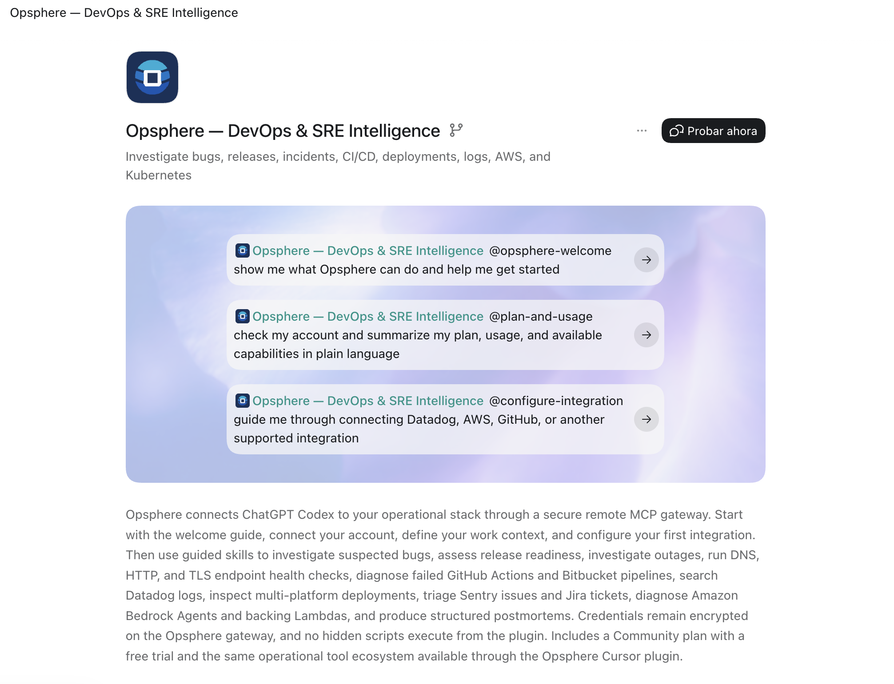
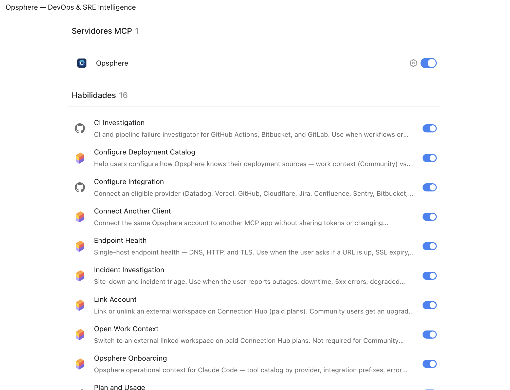
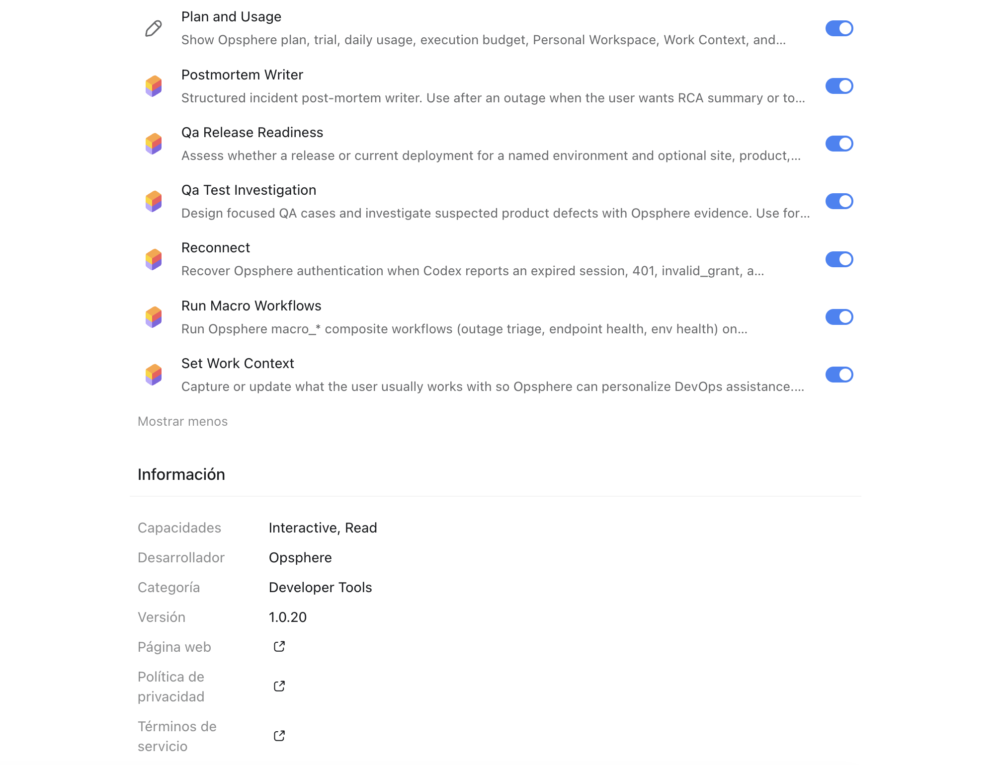

# Opsphere for Codex / ChatGPT

Opsphere connects Codex (CLI and ChatGPT desktop) to your monitoring, deployment and issue-tracking stack through the same secure remote MCP gateway (`https://mcp-cursor.opsphere.io/mcp`) used by every other Opsphere client. Tool execution and credential storage run on the gateway.

Package version: see `version` in [`.codex-plugin/plugin.json`](../.codex-plugin/plugin.json). It is independent from the Cursor, Claude Code and other client versions.

## This folder is documentation only

Codex installs the plugin from the **repository root**, not from this folder. There is no manifest here and there must not be one: `.agents/plugins/marketplace.json` uses `source: ./`, so the plugin root is the repo root. Codex only accepts `local`, `url` or `"./"` sources, so do not put `"source": "github"` in the marketplace file, and do not nest a Codex manifest under [`plugins/opsphere/`](../plugins/opsphere/), which is the generated Cursor package.

Files that make up the Codex plugin, all at the repo root:

- [`.codex-plugin/plugin.json`](../.codex-plugin/plugin.json): plugin manifest.
- [`.agents/plugins/marketplace.json`](../.agents/plugins/marketplace.json): marketplace catalog (`source: ./`, `authentication: ON_INSTALL`).
- [`.mcp.json`](../.mcp.json): MCP config (gateway `url`, `oauth_resource`, `User-Agent` header, `oauth.client_id`). It is **not** compatible with Claude Code's `.claude.mcp.json`.
- [`skills/`](../skills/): skills shared with the other clients.

No credentials are included.

## Install from the public repo

Uses the repo root of `https://github.com/opsphere-io/opsphere-plugin`.

**Codex CLI or ChatGPT desktop (Git marketplace):**

```sh
npx @openai/codex plugin marketplace add opsphere-io/opsphere-plugin --ref main
```

Then restart ChatGPT desktop, open **Plugins**, select the **Opsphere** marketplace tab and choose **Install**. OAuth runs on install; there is no separate Connect button on the detail page. In ChatGPT desktop you can instead paste `https://github.com/opsphere-io/opsphere-plugin` in **Plugins → Add marketplace** (requires **Settings → Security → Developer mode**).

## Install from source

From a clone of the public repo:

```sh
git clone https://github.com/opsphere-io/opsphere-plugin.git
cd opsphere-plugin
./scripts/codex-install.sh        # optional: ChatGPT desktop local marketplace
./scripts/codex-mcp-config.sh     # ~/.codex/config.toml (User-Agent + client_id)
npx @openai/codex mcp login opsphere
```

`codex-mcp-config.sh` appends the required `User-Agent` header and the preset `codex-mcp` client id to `~/.codex/config.toml`. It is needed for Codex CLI OAuth; ChatGPT desktop reads the same metadata from `.mcp.json`.

## OAuth

OAuth 2.0 + PKCE is managed by Codex against the gateway, using the preset client id `codex-mcp`. Sign in with the same email as your other Opsphere clients and choose a workspace. Do not configure tokens or secrets yourself, and never copy token files between applications.

When the token expires or refresh returns `invalid_grant`, renew it outside the running Codex session, then start a **new** Codex task:

```sh
npx @openai/codex mcp logout opsphere
npx @openai/codex mcp login opsphere
```

## Using skills

Invoke skills with `@` in Codex chat, for example `@incident-investigation`, `@endpoint-health`, `@ci-investigation`, `@postmortem-writer`, `@configure-integration`, `@set-work-context`, `@configure-deployment-catalog` and `@run-macro-workflows`. Codex-native session-expiry recovery is `@reconnect`.

## Uninstall

Remove the plugin from **Plugins** in ChatGPT desktop, or remove the marketplace with the Codex CLI (`npx @openai/codex plugin marketplace --help` lists the subcommands). If you used the local install script, also remove `~/.codex/plugins/opsphere` and its entry in `~/.agents/plugins/marketplace.json`.

Local removal does not revoke the server session or delete your account, integrations, workspace or subscription. See [multiclient recovery](../docs/MULTICLIENT-SUPPORT.md).

## First run

After installing and signing in, ask Codex:

- “Call `ops_my_usage` to show my plan and active workspace. Do not change anything.”
- “Use `@endpoint-health` to check https://example.com. Read-only; do not change infrastructure.”
- “Use `@configure-integration` to show whether I can connect Datadog here. Do not collect secrets in chat.”

Do not copy OAuth files from Cursor, Claude Code, Warp, OpenCode, Antigravity or Copilot.

## Screenshots

### Sign in (common to all clients)

Every Opsphere client opens the same browser sign-in page during OAuth.

| | |
|---|---|
|  |  |
| *Sign in with your existing account — browser-based OAuth2.* | *New user? Create a free account in seconds — no credit card required.* |

### Codex / ChatGPT in action

The plugin detail page in these shots uses the Spanish ChatGPT UI. Labels below are the ones on screen.

**1. Open the plugin page.** The title is **Opsphere — DevOps & SRE Intelligence**. Starter prompts are `@opsphere-welcome`, `@plan-and-usage` and `@configure-integration`. The description covers the remote MCP gateway, guided skills, and credentials staying on the gateway. The action button is **Probar ahora**.



**2. Check MCP and skills.** **Servidores MCP** shows **1** server, **Opsphere**, with the toggle on. **Habilidades** shows **16** skills. This shot is the first half: CI Investigation through Opsphere Onboarding, with Plan and Usage starting at the bottom.



**3. Read the rest of the skills and plugin info.** The list continues from Plan and Usage through Set Work Context. **Información** lists capabilities **Interactive, Read**, developer **Opsphere**, category **Developer Tools** and version **1.0.20** (the version in [`.codex-plugin/plugin.json`](../.codex-plugin/plugin.json)).



## Testing

Reviewer steps: [docs/CODEX-TEST-CASES.md](../docs/CODEX-TEST-CASES.md). Install paths and troubleshooting: [docs/INSTALL.md](../docs/INSTALL.md#codex--chatgpt) and [docs/TROUBLESHOOTING.md](../docs/TROUBLESHOOTING.md#codex--chatgpt-cli).
