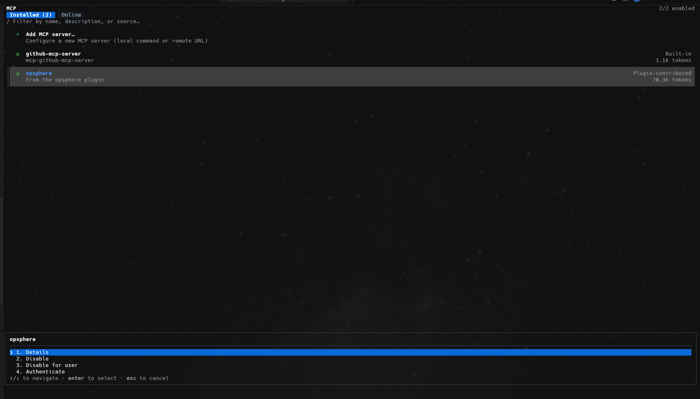
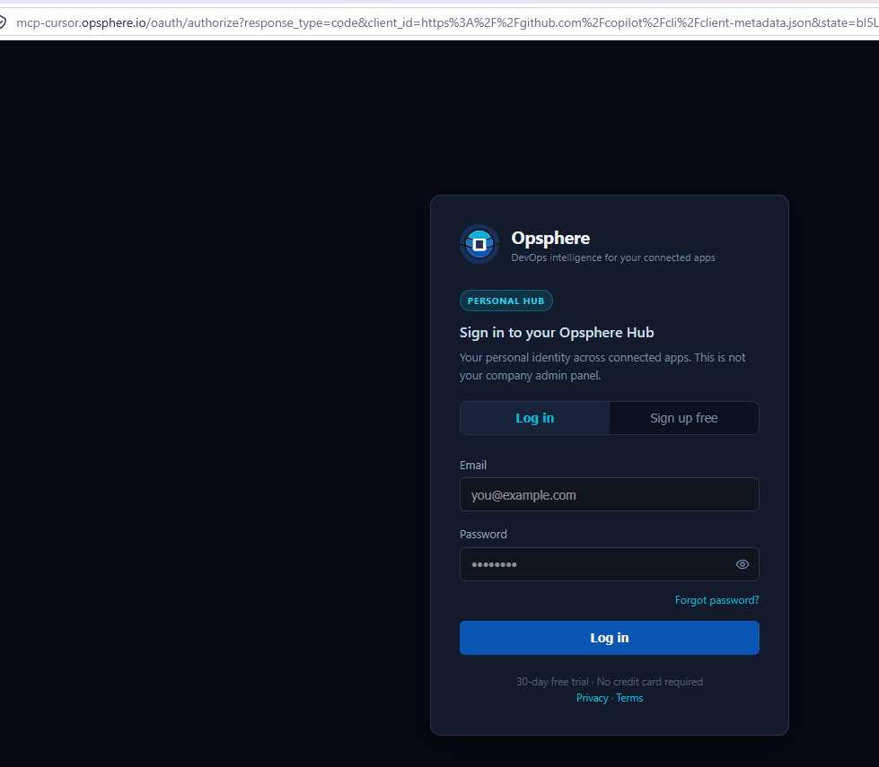
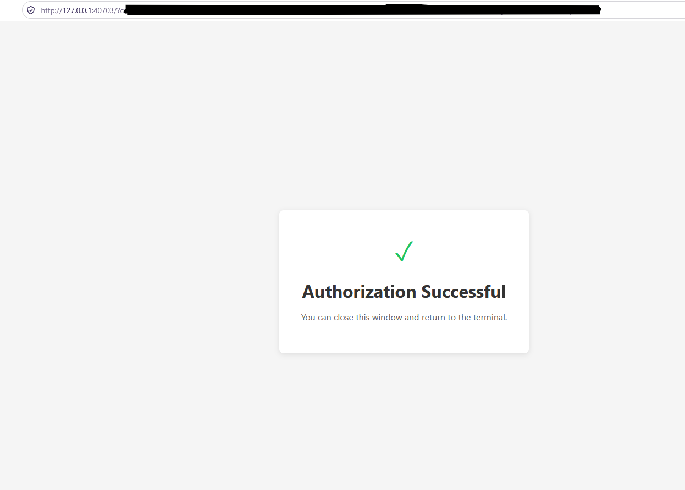
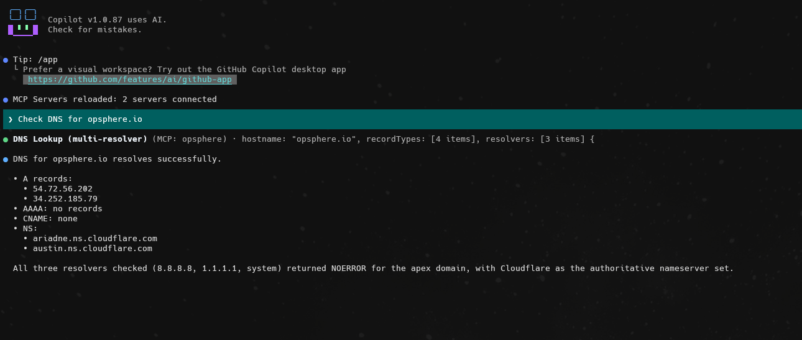

# Opsphere for GitHub Copilot CLI

Use the [official generated Copilot connection guide](guides/copilot.md) for the endpoint, Agent Plugins `mcp.json`, DCR OAuth, plan compatibility and troubleshooting. The guide is generated from the canonical connection catalog.

Package version **1.0.0**. This folder does not change the Cursor, Codex, Claude Code, Warp, OpenCode or Antigravity plugin bundles.

## Obtain the package

Follow the public package availability check in the guide before downloading. MCP-only setup needs no package. This folder adds Agent Plugins `plugin.json` and `mcp.json`, portable skills, and Copilot-specific agents, commands and rules under `com.github.copilot/`. No credentials are included.

## Install (plugin)

Choose **one** of:

**From the public repo** (`https://github.com/opsphere-io/opsphere-plugin`, this folder only, no clone needed):

```sh
copilot plugin install opsphere-io/opsphere-plugin:opsphere-copilot
```

**From the public repo as a marketplace** (uses `.github/plugin/marketplace.json`):

```sh
copilot plugin marketplace add opsphere-io/opsphere-plugin
copilot plugin install opsphere@opsphere
```

**From a local copy:**

```sh
copilot plugin install /absolute/path/to/opsphere-copilot
```

Then start a **new** Copilot CLI session. Confirm with `copilot plugin list` and `/skills list`. Do not enable a second MCP entry named `opsphere` while the plugin is installed.

Do not add a repo-root `marketplace.json`, `.github/mcp.json` or `.github/plugin/plugin.json` in this repository. Copilot's marketplace for this repo is `.github/plugin/marketplace.json` only.

## OAuth (DCR)

OAuth is client-managed. Copilot discovers authorization, uses PKCE S256 and attempts dynamic client registration. Sign in with the same email as your other Opsphere clients and choose a workspace. Do not configure `client_id`, callback, tokens or secrets in the plugin. Credentials stay in Copilot storage (`~/.copilot/mcp-oauth-config/`). Do not copy token files from another client.

## MCP-only (exclusive)

```sh
copilot mcp add --transport http opsphere https://mcp-cursor.opsphere.io/mcp
```

Do not install the plugin at the same time. Do not set a static bearer token or client secret.

## Package contents

- `plugin.json` (Agent Plugins 1.0)
- `mcp.json` (`type: streamable-http`, gateway `url` only)
- `skills/`
- `com.github.copilot/agents/` (`*.agent.md`)
- `com.github.copilot/commands/`
- `com.github.copilot/rules/`

There is no `hooks.json` and no `install.mjs`. Copilot reads agents, commands and rules from `com.github.copilot/`, not from a root `agents/` directory.

## Uninstall

```sh
copilot plugin uninstall opsphere
```

Local removal does not revoke the server session or delete your account.

## First run

See [local examples](examples/local.md). Copilot cloud agent remains outside this package's support boundary.

## Screenshots

### Sign in (common to all clients)

Every Opsphere client opens the same browser sign-in page during OAuth.

| | |
|---|---|
|  |  |
| *Sign in with your existing account — browser-based OAuth2.* | *New user? Create a free account in seconds — no credit card required.* |

### GitHub Copilot CLI in action

Captured with GitHub Copilot CLI 1.0.87.

**1. Install the plugin** from the public repo, then start a **new** Copilot CLI session:

```sh
copilot plugin install opsphere-io/opsphere-plugin:opsphere-copilot
```

**2. Run `/mcp` and authenticate.** Opsphere is listed under **Installed** as `opsphere`, "From the opsphere plugin" (plugin-contributed), next to the built-in `github-mcp-server`. Select it and choose **Authenticate**.



**3. Sign in in the browser.** Copilot opens the Opsphere authorize page. Log in, or choose **Sign up free**.



**4. Return to the terminal.** After sign-in the browser lands on a local page (`http://127.0.0.1:<port>`) that says **Authorization Successful**. Unlike Antigravity, there is no code to paste. The address bar carries the authorization response, so it is redacted here; do not share it.



**5. Ask a first question:** `Check DNS for opsphere.io`. Copilot reports `MCP Servers reloaded: 2 servers connected`, calls the Opsphere `dns_lookup` tool (a read-only, multi-resolver lookup) and summarizes the A, AAAA, CNAME and NS records.



## Testing

Maintainer and reviewer steps: [docs/COPILOT-TEST-CASES.md](../docs/COPILOT-TEST-CASES.md). CI validates the package files. Live Copilot OAuth is a manual matrix and must not be marked passed without execution.
