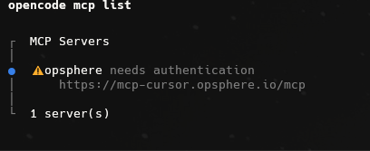
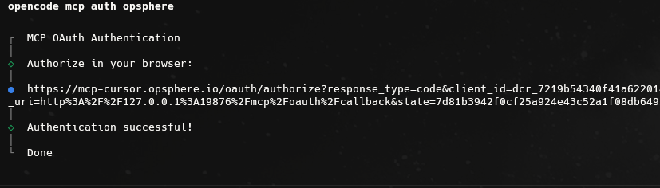
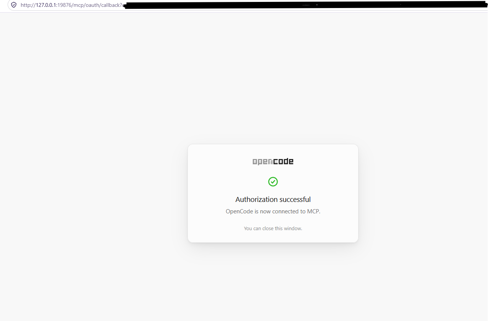
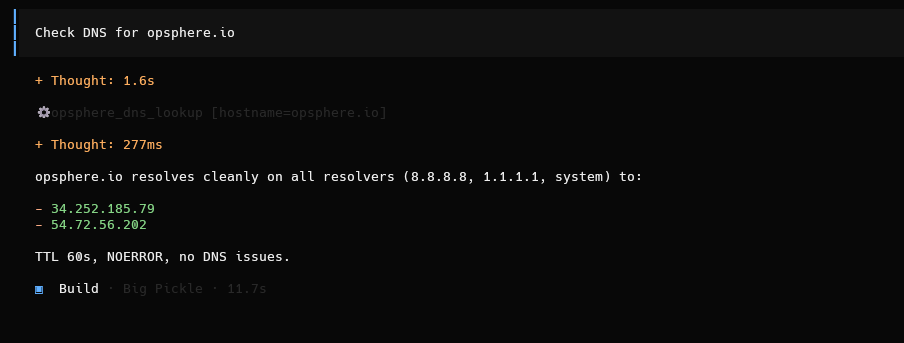

# Opsphere for OpenCode

Use the [official generated OpenCode connection guide](guides/opencode.md) for the endpoint, literal MCP configuration, OAuth, plan compatibility and troubleshooting. The guide and MCP resources are generated from one canonical connection contract, not maintained separately here.

Package version **1.0.0**. This folder does not change the Cursor, Codex or Claude Code plugin bundles.

## Obtain the package

Follow the public package availability check in the guide before downloading. MCP-only setup needs no package. This folder adds portable skills, OpenCode agents and commands, AGENTS.md rules and local examples. No credentials are included.

## Install in a project (recommended)

Requires Node.js 20 or newer. Install into a **throwaway project** (do not install into the Opsphere plugin repository).

### Install from the public repo

This package is not an OpenCode plugin, so do not use `opencode plugin add github:…`. Fetch only this folder of `https://github.com/opsphere-io/opsphere-plugin` with a sparse checkout and run the installer from it:

```sh
git clone --depth 1 --filter=blob:none --sparse https://github.com/opsphere-io/opsphere-plugin.git
cd opsphere-plugin
git sparse-checkout set opsphere-opencode
node opsphere-opencode/install.mjs install /absolute/path/to/your-project
```

### Install from an obtained copy

From this obtained package folder:

```sh
node install.mjs install /absolute/path/to/your-project
```

The installer merges `opencode.json`, adds a marked AGENTS.md section, and installs skills, agents and commands under `.opencode/`. It preserves other MCP entries and existing files; colliding skills or a different opsphere server stop installation before changes. It records ownership in `.opencode/opsphere-opencode-install.json`.

Then, from **that project**:

```sh
opencode mcp auth opsphere
```

Or in OpenCode: `/mcps` → opsphere → sign in. No authentication is performed by the installer.

Current OpenCode **1.x** (verified against 1.18.31) still uses V1 `mcp.opsphere`. The installer writes `type: remote`, `timeout: 60000` and `codemode: false`. Do not add the same server in both `<repo>/opencode.json` and `~/.config/opencode/opencode.json(c)`.

For manual installation, merge [mcp/opsphere.json](mcp/opsphere.json) into `opencode.json`, copy `skills/`, `agents/` and `commands/` into `.opencode/`, and merge `rules/AGENTS.md`. Record the files you added; the uninstaller only manages its own manifest.

If your OpenCode build requires V2 `mcp.servers`, nest the same `opsphere` object under `mcp.servers` instead of `mcp.opsphere`. Keep `codemode` false and a catalog timeout of at least 60000 ms.

## MCP-only (no package)

From the **project directory** (so OpenCode writes project config, not global):

```sh
opencode mcp add opsphere --url https://mcp-cursor.opsphere.io/mcp
```

Then edit the `opsphere` server object and set `timeout` to `60000` and `codemode` to `false`. `opencode mcp add` does not set those fields. Running it outside a project can write `~/.config/opencode/opencode.json(c)` instead of `<repo>/opencode.json`.

Alternatively, merge the JSON in the [connection guide](guides/opencode.md) into `<repo>/opencode.json` yourself. Then `opencode mcp auth opsphere` or `/mcps`.

Global MCP-only configuration (`~/.config/opencode/opencode.json` or `opencode.jsonc`) is an alternative; avoid adding both global and project entries unintentionally.

## First run

See [local examples](examples/local.md). Skills are not an import of another host's plugin engine. Do not copy `~/.local/share/opencode/mcp-auth.json` or any OAuth files from Cursor, Codex, Claude Code, Warp or Antigravity.

To sign in again: `opencode mcp logout opsphere`, then `opencode mcp auth opsphere`.

## Screenshots

### Sign in (common to all clients)

Every Opsphere client opens the same browser sign-in page during OAuth.

| | |
|---|---|
|  |  |
| *Sign in with your existing account — browser-based OAuth2.* | *New user? Create a free account in seconds — no credit card required.* |

### OpenCode in action

**1. Install into a throwaway project** (see [Install from the public repo](#install-from-the-public-repo) above), then work from **that project**:

```sh
node opsphere-opencode/install.mjs install /absolute/path/to/your-project
cd /absolute/path/to/your-project
```

**2. Check the server.** `opencode mcp list` shows `opsphere` with the gateway URL and `needs authentication`, because the installer never signs you in.



**3. Authenticate.** `opencode mcp auth opsphere` prints an authorize URL and opens your browser. Sign in on the Opsphere page shown in the sign-in screenshots above. OpenCode registers its own dynamic client (`client_id=dcr_…`) and receives the callback on a local `127.0.0.1` port. When the browser step finishes, the terminal prints `Authentication successful!`. The URL contains one-time values, so do not share yours.



**4. Finish in the browser.** The callback page says **Authorization successful. OpenCode is now connected to MCP.** and you can close the window. The address bar carries the authorization response, so it is redacted here; do not share it.



**5. Ask a first question:** `Check DNS for opsphere.io`. OpenCode calls the Opsphere `opsphere_dns_lookup` tool (read-only) and summarizes the answer: resolvers, addresses, TTL and status.



## Uninstall or upgrade

```sh
node install.mjs uninstall /absolute/path/to/your-project
```

Uninstall removes only the unchanged MCP entry it introduced and its exact rules block. Unchanged owned files are moved to `.opencode/opsphere-opencode-removed-<timestamp>/` for recovery. Edited files and pre-existing matching files are preserved and reported. Empty directories and config files may remain. No recursive project deletion is used.

For upgrades, uninstall the old package, review preserved edits, then install the new package. Keep the old package available until uninstall finishes.

Local removal does not revoke the server session or delete your account, integrations, workspace or subscription.

## Testing

Maintainer and reviewer steps: [docs/OPENCODE-TEST-CASES.md](../docs/OPENCODE-TEST-CASES.md).
